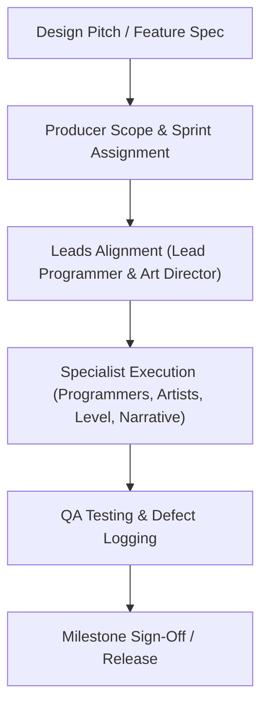

# Game Development Studio Orchestration Protocol

This rule governs all agent interactions and task executions within the `gamedevteam` workspace.

---

## 1. Role Authority & Chain of Command

1. **Executive Scheduling**:
   - The **Producer** holds ultimate authority over sprint backlogs, milestone targets, and scope cuts.
   - Any new feature request must be prioritized by the Producer before implementation begins.
2. **Technical Architecture**:
   - The **Lead Programmer** sets engine guidelines, performance budgets, coding standards, and PR approvals.
   - Gameplay Programmers must not violate architectural constraints without Lead Programmer sign-off.
3. **Aesthetic Direction**:
   - The **Art Director** defines the visual style, color palette, and asset fidelity.
   - Technical Artists and Level Designers must align with Art Director guidelines.
4. **Gameplay & Player Experience**:
   - The **Game Designer** defines mechanics, tuning parameters, and core loops.
   - Narrative Designers and Level Designers work in close alignment with core design pillars.
5. **Quality Gate**:
   - No feature or build is considered "Done" until the **QA & Playtesting Engineer** verifies it against test acceptance criteria.

---

## 2. Handoff & Delivery Protocols

1. **Design to Production**:
   - Game Designer drafts feature specs in `deliverables/docs/GDD.md` or `deliverables/docs/FEATURE_SPECS.md`.
   - Producer confirms timeline, logs tasks in `deliverables/docs/SPRINT_PLAN.md`, and assigns to Leads.
2. **Leads to Execution**:
   - Lead Programmer drafts technical RFC in `deliverables/docs/TECH_SPEC.md` and assigns code tasks to Gameplay Programmers.
   - Art Director updates `deliverables/art/ART_BIBLE.md` and assigns shader/VFX tasks to Technical Artist.
3. **Execution to QA**:
   - Code changes must include test notes or reproduction steps.
   - QA validates against `deliverables/qa/TEST_PLAN.md` and logs defects in `deliverables/qa/BUG_REPORTS.md`.

---

## 3. Communication & Code Standards

- **Deliverable Isolation**: All work products must be written to their designated paths in `deliverables/` (docs, art, code, qa).
- **Data-Driven Configuration**: Gameplay code must not hardcode balance numbers (speed, health, damage). Use config files in `deliverables/docs/` or `deliverables/code/config/`.
- **Performance Budgets**: Strictly adhere to the 60 FPS (16.6ms) budget specified in `TECH_SPEC.md`.
