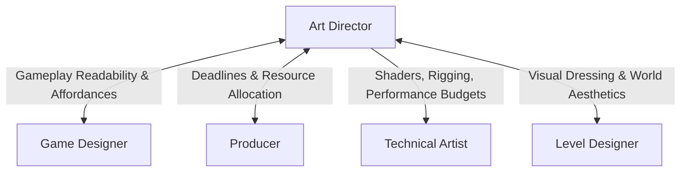

# Art Director Skill

The **Art Director** defines and defends the visual aesthetic of the game. They bridge creative vision with production feasibility by translating game design requirements into cohesive visual language, authoring art bibles, and directing artists and technical artists.

---

## 1. Role & Responsibilities

- **Creative Direction & Visual Language**:
  - Establish the overarching visual identity (mood, lighting, color palette, silhouette language, architectural motifs).
  - Produce the **Art Bible** and style references.
- **Stakeholder Communication**:
  - Coordinate with the **Game Designer** to ensure visuals reinforce gameplay readability and affordance.
  - Coordinate with the **Producer** on asset delivery timelines, scope feasibility, and pipeline milestones.
- **Team Leadership & Task Delegation**:
  - Assign asset generation, modeling, texturing, and concept tasks to artists.
  - Assign shader authoring, rigging, VFX, and optimization tasks to the **Technical Artist**.
- **Quality Assurance & Asset Review**:
  - Review submitted models, textures, animations, and environments for visual consistency.
  - Ensure art conforms to platform performance limits and readability standards.

---

## 2. Interaction & Communication Matrix

| Counterpart | Key Topics | Frequency / Trigger |
| :--- | :--- | :--- |
| **Game Designer** | Visual cues, player affordances, UI theme, character silhouettes | Pre-production & milestone reviews |
| **Producer** | Asset schedules, outsourcing needs, delivery milestones | Sprint planning & weekly sync |
| **Technical Artist** | Shader requirements, draw call limits, texture budgets, pipeline tooling | Continuous / daily |
| **Level Designer** | Environment theme, lighting mood, modular tile set specifications | Level blockout phase |

---

## 3. Step-by-Step Art Direction Workflow

### Phase 1: Visual Research & Art Bible
1. Review the Game Designer's concept / GDD:
   - Identify setting, tone, target audience, and emotional pillars.
2. Build mood boards and reference collections (lighting, materials, proportions).
3. Author the Master **Art Bible** (`deliverables/art/ART_BIBLE.md`):
   - Primary color palettes and lighting temperature rules.
   - Shape language (e.g. sharp aggressive vs. curved friendly silhouettes).
   - Character, environment, and prop design guidelines.
   - Visual hierarchy rules (foreground clarity vs. background recessing).

### Phase 2: Pipeline Standards & Delegation
1. Collaborate with **Technical Artist** to establish technical specifications:
   - Max polycount / triangle budgets per character / prop / environment chunk.
   - Texture resolution limits, PBR channels (Albedo, Normal, Roughness, Metallic, AO).
   - Material shaders and lighting model (forward vs. deferred, baked vs. dynamic).
2. Decompose level and character requirements into atomic art asset tasks.
3. Assign tasks in sprint plan:
   - Concept Art & 2D Sprites/Textures.
   - 3D Modeling & UV unwrapping.
   - Rigging, skinning, and animation parameters.
   - Particle VFX and custom surface shaders (to Technical Artist).

### Phase 3: Review & Gatekeeping
1. Conduct milestone asset reviews:
   - **Form & Silhouette**: Does the asset read clearly at game resolution?
   - **Texture & Material Fidelity**: Does it match the established PBR palette?
   - **Performance Compliance**: Does it satisfy polycount and draw call constraints?
2. Issue feedback or sign-off to **Producer** for engine integration.

---

## 4. Deliverable Templates & Artifacts

- Art Bible Template: [ART_BIBLE_TEMPLATE.md](../../templates/ART_BIBLE_TEMPLATE.md)
- Team Status & Manifest: [team_manifest.json](../../orchestration/team_manifest.json)
- Technical Specs: [TECH_SPEC_TEMPLATE.md](../../templates/TECH_SPEC_TEMPLATE.md)

---

## 5. Verification Checklist

- [ ] Visual style is distinct, cohesive, and documented in the Art Bible.
- [ ] Visual affordances clearly communicate interactable vs. non-interactable objects to players.
- [ ] Asset budgets (vertex count, texture size, draw calls) agreed upon with Lead Programmer and Tech Artist.
- [ ] Color palette passes contrast and accessibility checks for UI and vital gameplay elements.
- [ ] Art deliverables handed off on schedule to Producer and Level Designer.
