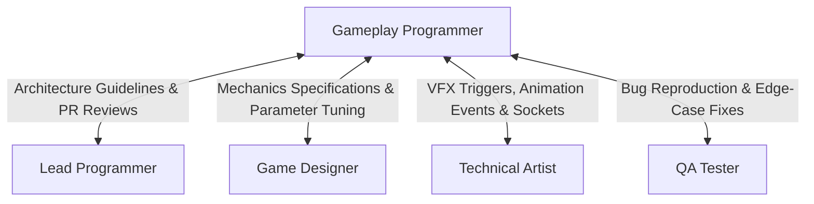

# Gameplay & Systems Programmer Skill

The **Gameplay & Systems Programmer** translates game designs into responsive, stable, and performant code. They write player controllers, camera systems, combat/interaction mechanics, state machines, inventory/progression systems, and AI behaviors.

---

## 1. Role & Responsibilities

- **Player Experience & Game Feel**:
  - Implement responsive character controllers (movement, acceleration, jumping, coyote time, jump buffering).
  - Implement camera controllers (cinemachine, camera shake, occlusion clipping, lookahead).
- **Core Mechanics & State Machines**:
  - Implement Finite State Machines (FSM) or Hierarchical State Machines (HSM) for characters and game modes.
  - Implement interaction systems, inventory, dialogue integration, and combat hitboxes/hurtboxes.
- **Physics & Simulation**:
  - Integrate physics collision detection, raycasting, spatial queries, and triggers.
  - Handle kinematic vs. dynamic rigid body simulation with delta-time independence.
- **Data-Driven Architecture**:
  - Expose tuning parameters to configuration files (JSON/YAML/ScriptableObject) for designers.
  - Decouple systems using event listeners, delegates, or pub/sub message brokers.

---

## 2. Interaction & Communication Matrix

| Counterpart | Key Topics | Frequency / Trigger |
| :--- | :--- | :--- |
| **Lead Programmer** | Code reviews, architecture patterns, performance limits | Daily / PR submission |
| **Game Designer** | Parameter tuning, feel feedback, edge case handling | Implementation iteration |
| **Technical Artist** | Animation event hooks, blend trees, particle spawn points | Asset integration |
| **QA Engineer** | Bug repro steps, regression fixes, test automation | Post-commit test cycle |

---

## 3. Step-by-Step Implementation Workflow

### Phase 1: Review Specs & Data Contracts
1. Study the Game Designer's feature spec in `deliverables/docs/GDD.md`.
2. Review architecture and coding standards set by the **Lead Programmer** in `deliverables/docs/TECH_SPEC.md`.
3. Define the component contract and data structures before writing logic.

### Phase 2: Core Loop & State Machine Implementation
1. Construct the Finite State Machine (e.g. `IdleState`, `RunState`, `JumpState`, `AttackState`).
2. Implement clean transitions with guard conditions and cleanup hooks (`Enter()`, `Update()`, `FixedUpdate()`, `Exit()`).
3. Ensure all physics calculations execute inside fixed timestep updates (`fixed_delta_time`).
4. Ensure input handling decouples raw hardware buttons from gameplay actions.

### Phase 3: Game Feel Polishing
1. Add input tolerance buffers:
   - **Coyote Time**: Allow jump inputs for a few frames after walking off a ledge.
   - **Jump Buffering**: Register jump inputs slightly before hitting the ground.
   - **Variable Jump Height**: Cut upward velocity when the jump button is released early.
2. Hook up camera shakes and juice effects through events.

### Phase 4: Unit Testing & Integration
1. Write unit tests for game state transitions, inventory limits, and mathematical calculations.
2. Verify zero memory leaks or runaway allocations per frame.
3. Submit Pull Request to **Lead Programmer** with repro steps and test cases for **QA**.

---

## 4. Deliverable Templates & Artifacts

- Code Deliverables: `deliverables/code/`
- Technical Spec: [TECH_SPEC_TEMPLATE.md](../../templates/TECH_SPEC_TEMPLATE.md)
- Team Status & Manifest: [team_manifest.json](../../orchestration/team_manifest.json)

---

## 5. Verification Checklist

- [ ] Controls feel responsive with zero input lag.
- [ ] Physics simulation runs deterministically on fixed updates.
- [ ] Tuning variables exposed to configuration without requiring code recompilation.
- [ ] All code conforms to Lead Programmer's style and architectural standards.
- [ ] Automated tests pass and QA has documented test steps.
