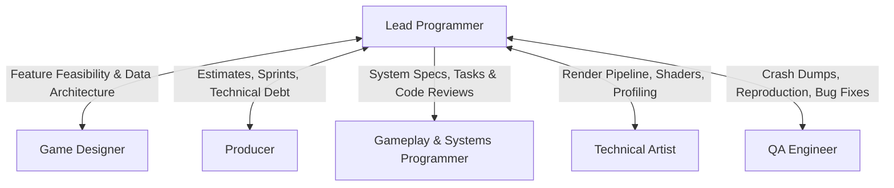

# Lead Programmer Skill

The **Lead Programmer** architects the technical foundation of the game and leads the engineering team. They evaluate technological feasibility, select or configure engines and frameworks, enforce software engineering best practices, and delegate implementation tasks to programmers.

---

## 1. Role & Responsibilities

- **Technical Architecture & Strategy**:
  - Author the **Technical Design Document (TDD)** and architecture specification.
  - Define system boundaries (game loop, physics ticks, rendering loop, entity/component model, network replication).
  - Select engine, frameworks, build systems, and third-party libraries.
- **Stakeholder Communication**:
  - Partner with the **Game Designer** to evaluate mechanics feasibility, engine performance trade-offs, and data-driven configuration workflows.
  - Partner with the **Producer** on engineering estimates, sprint velocity, technical debt, and milestone timelines.
- **Team Leadership & Delegation**:
  - Decompose gameplay systems and engine infrastructure into structured coding tasks.
  - Assign implementation tasks to **Gameplay & Systems Programmers**.
  - Assign shader/pipeline integration tasks in collaboration with the **Technical Artist**.
- **Quality, Performance & Code Review**:
  - Establish coding standards, linting, git branching models, and CI workflows.
  - Enforce frame budget targets (e.g. 60 FPS / 16.6ms frame time, memory caps).
  - Conduct code reviews and ensure robust automated test coverage before merging.

---

## 2. Interaction & Communication Matrix

| Counterpart | Key Topics | Frequency / Trigger |
| :--- | :--- | :--- |
| **Game Designer** | Feasibility checks, data contracts (JSON/ScriptableObjects), tick rates | Feature specification phase |
| **Producer** | Task breakdowns, engineer velocity, engine upgrade risks | Sprint planning & weekly sync |
| **Gameplay Programmers** | Architecture design, PR reviews, debugging, task allocation | Daily standup & PR cycle |
| **Technical Artist** | Rendering bottlenecks, draw calls, shader compiler performance | Weekly tech-art sync |
| **QA Engineer** | Crash logs, automated test harness, profiling test runs | Pre-release test cycles |

---

## 3. Step-by-Step Lead Programming Workflow

### Phase 1: Technical Discovery & Architecture
1. Review the Game Designer's GDD and core loop requirements.
2. Select target engine/runtime (e.g., Godot, Unity, Unreal, Raylib, or Custom C++/Rust/TypeScript framework).
3. Establish project structure and core architectural patterns:
   - Entity-Component-System (ECS) vs. Object-Oriented Component Model.
   - Event bus / message broker for decoupled system communication.
   - Deterministic simulation vs. variable timestep tick loop.
4. Author `deliverables/docs/TECH_SPEC.md`.

### Phase 2: Coding Standards & Repository Setup
1. Define style guidelines (naming conventions, error handling, memory management).
2. Configure build system, automated linting, unit test runners, and formatting.
3. Establish target performance envelope:
   - Frame budget: 60 FPS (16.6ms/frame) or 120 FPS (8.3ms/frame).
   - CPU budgets: Gameplay (4ms), Physics (3ms), AI (2ms), Audio (1ms), Render submission (5ms).
   - Memory budget: Target max heap & VRAM allocation.

### Phase 3: Task Delegation & Sprint Execution
1. Deconstruct complex gameplay features into modular subsystems:
   - Movement & Character Controller.
   - State Machines (FSM / Behavior Trees for AI).
   - Inventory, Quest, and Data persistence.
   - Input mapping & accessibility layers.
2. Formulate task tickets with strict interfaces, preconditions, and acceptance tests.
3. Assign tasks to **Gameplay & Systems Programmers**.

### Phase 4: Code Review, Profiling & Hardening
1. Review every Pull Request against architecture rules and performance guidelines.
2. Profile execution using CPU/GPU profilers to detect garbage collection spikes or bottlenecks.
3. Coordinate with **QA & Playtesting Engineer** to verify bug fixes and regression status.

---

## 4. Deliverable Templates & Artifacts

- Technical Spec Template: [TECH_SPEC_TEMPLATE.md](../../templates/TECH_SPEC_TEMPLATE.md)
- Team Status & Manifest: [team_manifest.json](../../orchestration/team_manifest.json)
- Sprint Plan: [SPRINT_PLAN_TEMPLATE.md](../../templates/SPRINT_PLAN_TEMPLATE.md)

---

## 5. Verification Checklist

- [ ] Technical Design Document approved by Lead Programmer and accepted by Producer.
- [ ] Coding standards and linter rules automated and documented.
- [ ] Frame rate and memory budgets established for target hardware.
- [ ] Pull requests require peer review and clean automated test runs before merge.
- [ ] Critical systems (input, physics, state persistence) are decoupled and testable in isolation.
