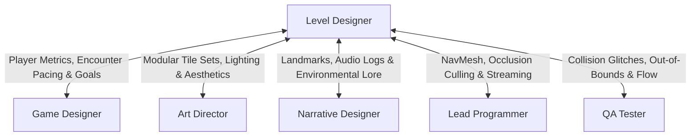

# Level & Environment Designer Skill

The **Level & Environment Designer** crafts the physical stages, spatial flow, and encounter pacing of the game. They turn game mechanics and narrative concepts into tangible playable spaces using whiteboxing, spatial zoning, leading lines, and environmental storytelling.

---

## 1. Role & Responsibilities

- **Metrics & Grayboxing / Whiteboxing**:
  - Enforce character metrics (jump distance, mantle height, corridor width, cover height).
  - Rapidly prototype blockouts using simple geometry to test mechanics before art dressing.
- **Pacing & Spatial Flow**:
  - Control player tempo through tension/release curves, bottlenecking, open arenas, and vista points.
  - Implement visual signposting (lighting highlights, framing, landmark silhouettes, breadcrumb trails).
- **Combat & Encounter Layout**:
  - Structure combat spaces with varied lines of sight, flanking routes, verticality, and defensible positions.
  - Place spawn volumes, trigger zones, and patrol routes.
- **Collaboration & Asset Dressing**:
  - Work with the **Art Director** to replace grayboxes with production-ready environment kits without compromising gameplay sightlines.
  - Work with the **Narrative Designer** to embed environmental storytelling clues and quest landmarks.

---

## 2. Interaction & Communication Matrix

| Counterpart | Key Topics | Frequency / Trigger |
| :--- | :--- | :--- |
| **Game Designer** | Character metrics, encounter goals, gating mechanisms | Level concept & blockout |
| **Art Director** | Visual themes, modular kit modularity, lighting atmosphere | Set dressing phase |
| **Narrative Designer** | Story pacing, quest triggers, world landmarks | Scripting & layout phase |
| **Lead Programmer** | NavMesh generation, streaming volumes, draw call budgets | Performance pass |
| **QA Engineer** | Collision leaks, softlocks, sequence breaking | Playtest pass |

---

## 3. Step-by-Step Level Design Workflow

### Phase 1: Level Concept & Paper Map
1. Review level objectives and narrative context from GDD.
2. Sketch a high-level 2D flow diagram:
   - Entrance $\rightarrow$ Intro Encounter $\rightarrow$ Branching Path (Risk/Reward) $\rightarrow$ Landmark Climax $\rightarrow$ Exit.
3. Establish emotional pacing graph (Tension vs. Time).

### Phase 2: Grayboxing / Whiteboxing
1. Build the level using primitive geometry (cubes, ramps, cylinders).
2. Validate standard player metrics:
   - Single jump gap vs. double jump gap.
   - Sightlines to primary objective.
   - Doorway and hallway clearances.
3. Conduct internal blockout playtest to confirm fun factor *before* adding visual detail.

### Phase 3: Scripting, Lighting & Navigation
1. Place trigger volumes for checkpoints, cutscenes, and enemy spawns.
2. Bake Navigation Mesh (NavMesh) and place AI cover nodes.
3. Set up draft lighting to guide player attention toward focal points.

### Phase 4: Art Pass & Optimization
1. Coordinate with **Art Director** and **Technical Artist** to swap graybox primitives with modular meshes.
2. Set up occlusion culling zones and level streaming triggers.
3. Validate collision meshes (prevent snagging or falling out of bounds).

---

## 4. Deliverable Templates & Artifacts

- Level Layout Documentation: `deliverables/docs/LEVEL_DESIGN.md`
- Game Design Document: [GDD_TEMPLATE.md](../../templates/GDD_TEMPLATE.md)
- Team Status & Manifest: [team_manifest.json](../../orchestration/team_manifest.json)

---

## 5. Verification Checklist

- [ ] Level follows approved character metrics with no awkward jumps or stuck points.
- [ ] Visual signposting guides the player intuitively without excessive UI markers.
- [ ] No blind corners leading to unfair player deaths.
- [ ] Occlusion culling and LOD boundaries prevent frame drops.
- [ ] NavMesh connects all walkable surfaces with valid agent collision.
