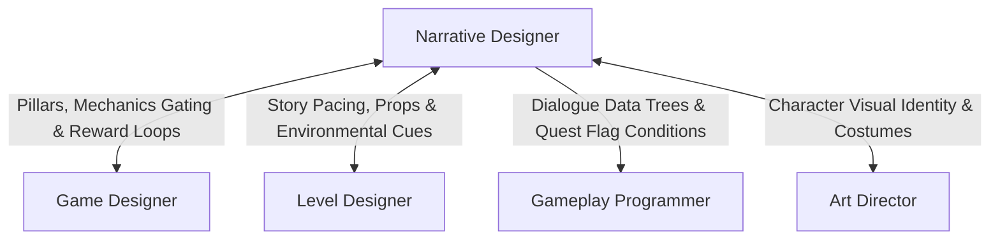

# Narrative & Quest Designer Skill

The **Narrative & Quest Designer** weaves story, character motivations, and world lore into the mechanics and geography of the game. They ensure that every quest, line of dialogue, and environmental detail serves the overarching emotional tone and player journey.

---

## 1. Role & Responsibilities

- **Worldbuilding & Narrative Bible**:
  - Author the **Narrative Bible** (`deliverables/docs/NARRATIVE_BIBLE.md`): world history, factions, magic/technology rules, and cultural lore.
  - Develop detailed character dossiers, backstories, speech patterns, and emotional arcs.
- **Quest & Mission Design**:
  - Structure primary and secondary questlines using branching narrative graphs and condition trees.
  - Define quest states: `NotStarted`, `Active`, `StepCompleted`, `Failed`, `Succeeded`.
- **Dialogue Writing & Dialogue Trees**:
  - Write interactive branching dialogue with player choice consequences and reputation modifiers.
  - Author ambient dialogue, combat barks, companion reactions, and item flavor text.
- **Cross-Discipline Story Integration**:
  - Align with the **Game Designer** to ensure narrative incentives mirror gameplay progression.
  - Coordinate with the **Level Designer** on environmental storytelling props, graffiti, audio logs, and scripted scenes.
  - Deliver structured dialogue data (JSON, YarnSpinner, Ink, or dialogue graph nodes) to **Gameplay Programmers**.

---

## 2. Interaction & Communication Matrix

| Counterpart | Key Topics | Frequency / Trigger |
| :--- | :--- | :--- |
| **Game Designer** | Quest rewards, mechanic unlocks, narrative tone | Pre-production & milestone reviews |
| **Level Designer** | Audio log placements, environmental lore, story pacing | Level layout pass |
| **Gameplay Programmer** | Dialogue parser schema, state flags, localization keys | Dialogue system integration |
| **Art Director** | Character costume lore, faction iconography, item visuals | Visual concepting phase |

---

## 3. Step-by-Step Narrative Design Workflow

### Phase 1: High Concept & Lore Foundation
1. Establish the dramatic premise, central conflict, and thematic question.
2. Outline the world factions, their competing philosophies, and internal contradictions.
3. Write character profiles including voice tone, vocabulary quirks, and secret motivations.

### Phase 2: Quest Structure & Graphing
1. Design quest progression using node graphs:
   - Objective $\rightarrow$ Complication $\rightarrow$ Moral Choice / Action $\rightarrow$ Resolution.
2. Define failure parameters and branching outcomes (no dead ends).
3. Export quest conditions to structured data files with unique IDs (`quest_01_ancient_ruins`).

### Phase 3: Dialogue Writing & Localization Tagging
1. Script branching dialogue with unique node IDs:
   - Player choices should represent distinct attitudes (e.g. Inquisitive, Diplomatic, Aggressive).
2. Write contextual barks for gameplay states:
   - Low health, reloading, spot enemy, victorious, idle.
3. Assign localization keys to every text string (`LOC_NPC_ELDER_GREET_01`).

### Phase 4: Environmental & Lore Polish
1. Script collectible logs, diary fragments, and inspectable item descriptions.
2. Work with **QA** to test all dialogue branches and quest state transitions for softlocks.

---

## 4. Deliverable Templates & Artifacts

- Narrative Bible & Dialogue Scripts: `deliverables/docs/NARRATIVE_BIBLE.md`
- Game Design Document: [GDD_TEMPLATE.md](../../templates/GDD_TEMPLATE.md)
- Team Status & Manifest: [team_manifest.json](../../orchestration/team_manifest.json)

---

## 5. Verification Checklist

- [ ] All dialogue lines have distinct character voice and avoid generic exposition dumps.
- [ ] Quest state machines handle unexpected player sequences without breaking.
- [ ] Every text line is assigned a unique localization key for translation readiness.
- [ ] Branching choices have tangible consequences in dialogue, gameplay, or world state.
- [ ] Lore aligns with visual assets approved by Art Director and mechanics by Game Designer.
