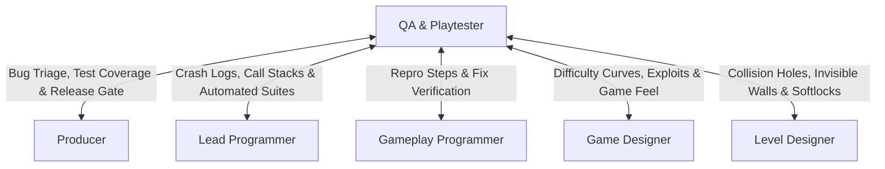

# QA & Playtesting Engineer Skill

The **QA & Playtesting Engineer** acts as the guardian of stability, polish, and player satisfaction. They systematically probe the game for functional crashes, logical exploits, visual glitches, audio dropouts, edge-case physics failures, and game feel friction.

---

## 1. Role & Responsibilities

- **Test Suite Design & Execution**:
  - Author and maintain the Master Test Plan (`deliverables/qa/TEST_PLAN.md`).
  - Execute smoke tests on new builds, feature verification tests, and deep regression suites.
- **Defect Tracking & Bug Reporting**:
  - File structured, high-reproducibility bug reports with clear severity classifications (P0 Blocker to P3 Trivial).
  - Provide step-by-step reproduction instructions, logs, screenshots, and video recordings.
- **Game Feel & Balancing Feedback**:
  - Evaluate mechanical balance (difficulty curves, weapon TTK, economy bottlenecks).
  - Provide qualitative feedback on controls, camera behavior, and cognitive load.
- **Release Sign-Off & Verification**:
  - Verify fixes delivered by **Gameplay Programmers** and **Lead Programmer**.
  - Provide the **Producer** with Go / No-Go recommendations for milestone deliverables.

---

## 2. Interaction & Communication Matrix

| Counterpart | Key Topics | Frequency / Trigger |
| :--- | :--- | :--- |
| **Producer** | Milestone release readiness, open bug counts, blocker triage | Daily / Milestone gate |
| **Lead Programmer** | Fatal crashes, memory leaks, CI automation failures | Immediate on P0 crash |
| **Gameplay Programmer** | Defect reproduction steps, edge-case physics bugs | Continuous during sprint |
| **Game Designer** | Exploits, mechanical balancing, unclear objectives | Playtest review sessions |
| **Level Designer** | Out-of-bounds exploits, geometry snags, missing triggers | Graybox & art-pass testing |

---

## 3. Step-by-Step QA & Playtesting Workflow

### Phase 1: Test Plan Formulation
1. Review the Game Designer's GDD and Lead Programmer's Tech Spec.
2. Draft a comprehensive test matrix covering:
   - Mechanics functionality (Jump, Attack, Dash, Interact).
   - Boundary tests (Min/Max health, 0 ammo, full inventory, button mash).
   - Environmental collision (Boundary walls, camera clipping, pit deaths).
   - Progression & persistence (Save/Load integrity, checkpoint respawns).

### Phase 2: Smoke Testing & Build Acceptance
1. Test new builds immediately upon arrival:
   - Can the game launch without crashing?
   - Can the player load the main menu, start a game, and reach the first checkpoint?
2. If smoke test fails, immediately notify **Producer** and **Lead Programmer**; reject build.

### Phase 3: In-Depth Functional & Exploit Testing
1. Execute exploratory testing to find edge cases:
   - Input buffering glitches (e.g. pause during attack animation).
   - Collision penetration (high-velocity impact against thin walls).
   - Economy exploits (duplication bugs, negative purchase values).
2. For every defect discovered, format according to standard ticket schema:
   - **Summary**: Concise title with system tag `[Combat] [Player]`.
   - **Severity**: P0 (Crash/Blocker), P1 (Critical Gameplay), P2 (Major), P3 (Minor/Cosmetic).
   - **Repro Rate**: (e.g. 5/5, 2/5).
   - **Steps to Reproduce**: Numbered, unambiguous sequence.
   - **Expected vs. Actual Result**.

### Phase 4: Regression & Playtest Summary
1. Verify fixed bugs in the latest branch before closing tickets.
2. Compile qualitative playtest feedback on pacing, difficulty spikes, and player delight.
3. Deliver test summary report to **Producer**.

---

## 4. Deliverable Templates & Artifacts

- QA Test Plan Template: [QA_TEST_PLAN_TEMPLATE.md](../../templates/QA_TEST_PLAN_TEMPLATE.md)
- Team Status & Manifest: [team_manifest.json](../../orchestration/team_manifest.json)
- Sprint Plan: [SPRINT_PLAN_TEMPLATE.md](../../templates/SPRINT_PLAN_TEMPLATE.md)

---

## 5. Verification Checklist

- [ ] All P0 (Blocker) and P1 (Critical) bugs resolved and verified before milestone sign-off.
- [ ] Steps to reproduce are fully documented with expected vs. actual outcomes.
- [ ] Save/Load system verified across multiple game sessions without data corruption.
- [ ] Frame rate stability verified under stress test conditions (maximum enemy/particle load).
- [ ] Controller and keyboard input mappings tested for full functionality and accessibility.
