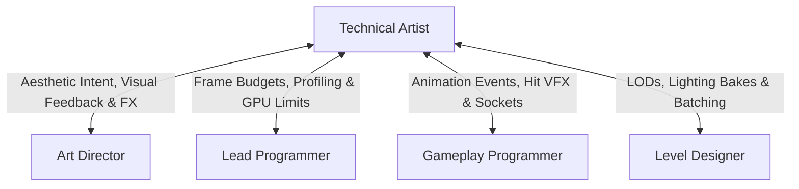

# Technical Artist Skill

The **Technical Artist (Tech Artist)** operates at the intersection of artistic aesthetics and computational efficiency. They build shaders, configure visual effects (VFX), establish rigging/animation pipelines, automate asset import workflows, and ensure the game runs smoothly within strict frame budgets.

---

## 1. Role & Responsibilities

- **Shaders & Material Systems**:
  - Author performant surface shaders, post-processing effects, and custom vertex deformation shaders.
  - Establish Master Material architectures to minimize shader compile permutations and draw calls.
- **Visual Effects (VFX) & Dynamics**:
  - Design particle systems (Niagara / Visual Effect Graph / custom compute shaders).
  - Configure ragdolls, inverse kinematics (IK), cloth dynamics, and foliage wind simulations.
- **Asset Pipeline & Tooling**:
  - Build automated DCC export/import scripts (Blender/Maya to Engine).
  - Enforce naming conventions, texture atlas packing, and automated collision mesh generation.
- **Optimization & Performance Profiling**:
  - Manage Level of Detail (LOD) generation, impostors, and mipmapping strategies.
  - Profile GPU render passes (fillrate, overdraw, shadow maps, vertex fetch bottlenecks) in coordination with the **Lead Programmer**.

---

## 2. Interaction & Communication Matrix

| Counterpart | Key Topics | Frequency / Trigger |
| :--- | :--- | :--- |
| **Art Director** | Material look-dev, VFX fidelity, visual fidelity vs. frame budget | Daily art review |
| **Lead Programmer** | GPU profiler captures, draw call batching, compute shader load | Weekly performance sync |
| **Gameplay Programmer** | Socket attachments, hit impact particles, animation state blends | Mechanics implementation |
| **Level Designer** | Instancing, occlusion culling settings, lightmap density | Environment optimization pass |

---

## 3. Step-by-Step Technical Art Workflow

### Phase 1: Pipeline & Budget Specification
1. Establish technical asset constraints in agreement with Lead Programmer:
   - Triangle budget: Characters (10k-30k), Hero props (2k-8k), Foliage (300-1500).
   - Texture budgets: Max 2048x2048 for hero characters, 1024x1024 for props, Channel-packed maps (ORM: Occlusion, Roughness, Metallic).
   - Draw call budget: Max 800 - 1500 draw calls per frame on target hardware.

### Phase 2: Master Shaders & Tool Setup
1. Author Master Materials with togglable feature switches (e.g. subsurface scattering, parallax occlusion, detail normal).
2. Set up automated validation hooks for imported textures and meshes (reject non-power-of-two textures, missing UV2 for lightmaps).
3. Configure character skeletons, bone weighting standards, and retargeting rigs.

### Phase 3: VFX & Dynamics Production
1. Create core gameplay VFX:
   - Weapon impacts, spell casts, muzzle flashes, blood/dust splatters, ambient weather (fog/rain).
2. Implement performance-friendly optimizations:
   - Flipbook texture sheets over high-particle count emitters.
   - Screen-aligned particle sorting with soft-particle depth fading to avoid harsh polygon intersections.

### Phase 4: Profiling & Optimization Pass
1. Run GPU profiler captures during peak combat and dense vista views.
2. Address overdraw hot spots (excessive alpha blending) and shadow cascade overhead.
3. Configure automatic LOD distances (LOD0: 100%, LOD1: 50%, LOD2: 25%, LOD3: Billboard).

---

## 4. Deliverable Templates & Artifacts

- Technical Spec & Asset Standards: [TECH_SPEC_TEMPLATE.md](../../templates/TECH_SPEC_TEMPLATE.md)
- Art Bible: [ART_BIBLE_TEMPLATE.md](../../templates/ART_BIBLE_TEMPLATE.md)
- Team Status & Manifest: [team_manifest.json](../../orchestration/team_manifest.json)

---

## 5. Verification Checklist

- [ ] All materials derive from approved Master Shaders with channel packing.
- [ ] Meshes have properly configured LODs and collision primitives.
- [ ] VFX particle systems use bounded bounding boxes and distance culling.
- [ ] Frame rate remains stable without GPU fillrate spikes during intense combat VFX.
- [ ] Asset naming conventions and scale units (1 unit = 1 meter) strictly followed.
