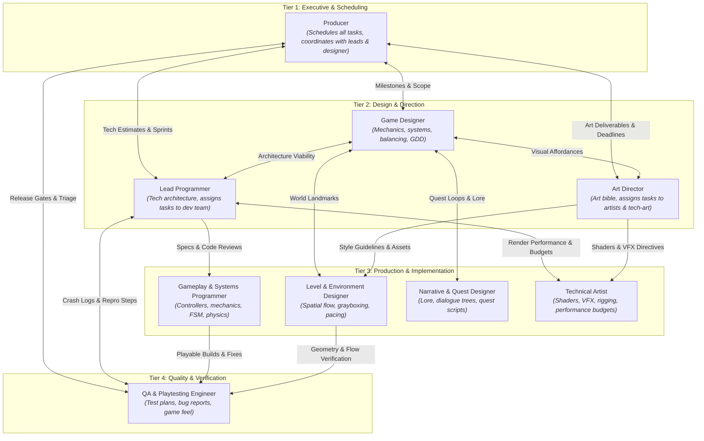

# GameDevTeam — Multi-Agent Studio Orchestration

A multi-agent game development studio orchestration designed for Antigravity. It equips agents with specialized roles, skills, and communication protocols covering the complete game development lifecycle—from pitch and design to code, art, audio-visual effects, and QA.

---

## 1. Studio Architecture & Role Hierarchy

The studio is organized into 4 collaborative tiers featuring 9 specialized skills:



---

## 2. The 9 Team Roles & Skills

| Role | Skill Identifier | Primary Responsibilities | Core Deliverables |
| :--- | :--- | :--- | :--- |
| **Producer** | [`producer`](.agents/skills/producer/SKILL.md) | Schedules project tasks, coordinates with leads & game designer, tracks milestones, manages risk | `deliverables/docs/MASTER_SCHEDULE.md`<br/>`deliverables/docs/SPRINT_PLAN.md` |
| **Art Director** | [`art-director`](.agents/skills/art-director/SKILL.md) | Manages communication with game designer & producer, assigns tasks for artists & tech artists, defines visual style | `deliverables/art/ART_BIBLE.md`<br/>`deliverables/art/STYLE_GUIDE.md` |
| **Lead Programmer** | [`lead-programmer`](.agents/skills/lead-programmer/SKILL.md) | Manages communication with game designer & producer, technical architecture, assigns tasks to dev team, reviews code | `deliverables/docs/TECH_SPEC.md`<br/>`deliverables/code/architecture_rfcs/` |
| **Game Designer** | [`game-designer`](.agents/skills/game-designer/SKILL.md) | Gameplay mechanics, systems balancing, game design documents (GDD), core loops | `deliverables/docs/GDD.md`<br/>`deliverables/docs/FEATURE_SPECS.md` |
| **Gameplay & Systems Programmer** | [`gameplay-programmer`](.agents/skills/gameplay-programmer/SKILL.md) | Character controllers, state machines, physics, movement, interaction & combat code | `deliverables/code/src/controllers/`<br/>`deliverables/code/src/systems/` |
| **Level & Environment Designer** | [`level-designer`](.agents/skills/level-designer/SKILL.md) | Level geometry, grayboxing/whiteboxing, encounter pacing, spatial flow, NavMesh setup | `deliverables/docs/LEVEL_DESIGN.md`<br/>`deliverables/levels/` |
| **Narrative & Quest Designer** | [`narrative-designer`](.agents/skills/narrative-designer/SKILL.md) | Lore bibles, character bios, branching dialogue trees, quest state graphs, barks | `deliverables/docs/NARRATIVE_BIBLE.md`<br/>`deliverables/narrative/` |
| **Technical Artist** | [`technical-artist`](.agents/skills/technical-artist/SKILL.md) | Custom shaders, particle VFX, rigging, performance profiling, asset import pipelines | `deliverables/art/shaders/`<br/>`deliverables/art/vfx/` |
| **QA & Playtesting Engineer** | [`qa-playtester`](.agents/skills/qa-playtester/SKILL.md) | Master test plans, regression testing, bug ticketing (P0-P3), repro steps, game feel | `deliverables/qa/TEST_PLAN.md`<br/>`deliverables/qa/BUG_REPORTS.md` |

---

## 3. Directory Layout

```text
gamedevteam/
├── README.md                      # Complete studio documentation & architecture guide
├── AGENTS.md                      # Agent rules & orchestration protocol
├── GEMINI.md                      # Antigravity discovery mirror rule
├── .agents/
│   ├── skills/                    # Antigravity skill packages
│   │   ├── producer/SKILL.md
│   │   ├── art-director/SKILL.md
│   │   ├── lead-programmer/SKILL.md
│   │   ├── game-designer/SKILL.md
│   │   ├── gameplay-programmer/SKILL.md
│   │   ├── level-designer/SKILL.md
│   │   ├── narrative-designer/SKILL.md
│   │   ├── technical-artist/SKILL.md
│   │   └── qa-playtester/SKILL.md
│   └── rules/
│       └── team-protocol.md       # Collaboration & handoff rules
├── orchestration/
│   ├── team_manifest.json         # Master team schema & keyword triggers
│   ├── orchestrator.py            # Python orchestration engine
│   ├── workflows.py               # Predefined multi-stage pipelines
│   └── run_orchestration.py       # Orchestration inspection CLI
├── templates/
│   ├── GDD_TEMPLATE.md            # Game Design Document standard
│   ├── TECH_SPEC_TEMPLATE.md      # Technical Architecture RFC standard
│   ├── ART_BIBLE_TEMPLATE.md      # Art Direction & Style Guide standard
│   ├── SPRINT_PLAN_TEMPLATE.md    # Producer Sprint & Milestone standard
│   └── QA_TEST_PLAN_TEMPLATE.md   # QA Test Case & Bug Report standard
└── deliverables/
    ├── docs/                      # GDD, Tech Specs, Schedules
    ├── art/                       # Art bibles, shaders, visual assets
    ├── code/                      # Controllers, systems, unit tests
    └── qa/                        # Test plans, bug tickets, playtest feedback
```

---

## 4. Orchestration CLI & Pipelines

An orchestration engine is included in `orchestration/` to inspect team status, query workflows, or generate subagent invocation prompts:

```bash
# List all 9 team roles and their details
python3 orchestration/run_orchestration.py --list

# List available multi-agent workflows
python3 orchestration/run_orchestration.py --workflows

# View details for a specific workflow (e.g. pitch to playable prototype)
python3 orchestration/run_orchestration.py --workflow pitch_to_prototype

# Identify which role should handle a task prompt
python3 orchestration/run_orchestration.py --prompt "We need an inventory state machine and item database"

# Run Pitch to Prototype with a custom idea prompt
python3 orchestration/run_orchestration.py --pitch "Cyberpunk stealth platformer with gravity manipulation"

# Run Pitch to Prototype with NO prompt (triggers Autonomous Design Synthesis)
python3 orchestration/run_orchestration.py --pitch
```

### Predefined Workflows:
1. **`pitch_to_prototype`**: Transforms an idea into a validated technical prototype.
   - **With user pitch**: Expands the user's high concept into 3 design pillars, a 30-second loop, movement metrics, and GDD.
   - **Without pitch (Autonomous Synthesis)**: The Game Designer synthesizes an original, non-cliché game concept by combining orthogonal **Game Design Patterns** (e.g. *momentum recoil + time-echo ghost replay + spatial inventory*) with an **Unconventional Visual Representation** (e.g. *Risograph halftone, stained-glass leadlight, architectural cyanotype, or tactile claymation*).
   - **Pipeline**: Game Designer (Pitch / Autonomous GDD) $\rightarrow$ Producer (Prototype Sprint) $\rightarrow$ Lead Programmer (Tech Architecture) $\rightarrow$ Art Director (Visual Bible) $\rightarrow$ Level Designer (Movement Graybox) $\rightarrow$ Gameplay Dev (Character Controller & FSM) $\rightarrow$ Tech Artist (Master Shaders & VFX) $\rightarrow$ QA (Smoke Test & Edge Cases).
2. **`feature_sprint`**: 2-week agile feature cycle from Game Designer spec to QA verification.
3. **`narrative_quest_pipeline`**: Lore bible & dialogue trees $\rightarrow$ Economy alignment $\rightarrow$ Level landmarks $\rightarrow$ Quest state machine $\rightarrow$ Branching QA testing.

---

## 5. Background Execution, Review Gates & Deliverable Population

The orchestration supports fully backgrounded execution, live status tracking, and step-in review gates:

### Background Pipeline Runner (`pipeline_runner.py`)
You can initialize the production pipeline and let it run asynchronously:

```bash
# 1. Initialize pipeline and populate deliverable files from templates
python3 orchestration/pipeline_runner.py --init --pitch "Cyberpunk gravity stealth"

# Or initialize in autonomous synthesis mode (no prompt provided):
python3 orchestration/pipeline_runner.py --init

# 2. Check live progress and review gates anytime:
python3 orchestration/pipeline_runner.py --status

# 3. Approve a deliverable when you have reviewed it:
python3 orchestration/pipeline_runner.py --approve-step 1
```

### Automatic Template Population into `deliverables/`
Template files in `templates/` serve as the clean structural schemas. When the pipeline runs:
- The templates are automatically instantiated into the working `deliverables/` folders:
  - `templates/GDD_TEMPLATE.md` $\rightarrow$ `deliverables/docs/GDD.md`
  - `templates/TECH_SPEC_TEMPLATE.md` $\rightarrow$ `deliverables/docs/TECH_SPEC.md`
  - `templates/SPRINT_PLAN_TEMPLATE.md` $\rightarrow$ `deliverables/docs/SPRINT_PLAN.md`
  - `templates/ART_BIBLE_TEMPLATE.md` $\rightarrow$ `deliverables/art/ART_BIBLE.md`
  - `templates/QA_TEST_PLAN_TEMPLATE.md` $\rightarrow$ `deliverables/qa/TEST_PLAN.md`
- The specialized agents (Game Designer, Lead Programmer, Art Director) populate the game-specific content directly within these deliverable files.
- A live markdown dashboard is continuously maintained at `deliverables/docs/PROJECT_DASHBOARD.md`.

---

## 6. Working with Antigravity Agents

Because the skills are formatted according to the standard Antigravity skill structure in `.agents/skills/`, Antigravity automatically detects all 9 skills. You can prompt the agent naturally:

- *"As the Producer, break down Milestone 1 into a sprint plan."*
- *"As the Lead Programmer, author the architecture specification for our combat state machine."*
- *"As the Art Director, establish the visual bible for a cyberpunk roguelite."*
- *"As the QA Tester, generate a comprehensive test plan for player jump and dash physics."*
- You can also run tasks as autonomous goals using `/goal` to let the agents work through milestones in the background while you review deliverables as they are populated.
