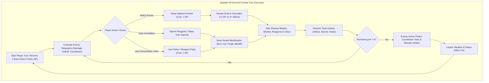

# Runes of the Avatar: Shards of Virtue — Game Design Document (GDD)

**Version**: 1.0  
**Author**: Game Designer  
**Lead Approvals**: Producer, Lead Programmer, Art Director  
**Target Platform**: PC (Steam / Windows / macOS / Linux), Steam Deck, Nintendo Switch  
**Genre**: Match-3 Turn-Based CRPG (Classic Tile-Based Overland Exploration + Cascade-Driven Runic Tactical Combat)

---

## 1. Executive Summary & Pillars

### 1.1 High Concept & Pitch
- **One-Sentence Hook**: A rich retro-modern CRPG fusing classic top-down tile exploration and the philosophical Eight Virtues of *Ultima* with a deep, cascade-driven runic combat engine inspired by *Bejeweled*.
- **Setting & Premise**: The sacred realm of Britannia lies fractured in the wake of the Cataclysm of the False Triad. The Great Codex of Ultimate Wisdom has shattered into crystalline remnants known as **Virtue Runestones**, destabilizing the elemental ley-lines and empowering dark entities across the overland. Summoned through the ancient Moongates as the prophesied Stranger, the player must assemble a fellowship of iconic companions (Mage, Bard, Paladin, Ranger), traverse wilderness, dungeons, and hamlets, restore the Eight Shrines of Virtue, and master the **Runic Combat Grid** to vanquish the Shadowlords and ascend as the Avatar of Virtue.

### 1.2 Core Pillars
1. **Cascade-Driven Runic Combat (Tactical Puzzle Meets Turn-Based Strategy)**:
   Every tactical encounter transitions from overland locomotion into an intricate 8x8 runic battle grid. Matching runes of Blades, Shields, Herbal Reagents, and Virtue Prisms fuels party Action Points, shields against telegraphed enemy attacks, and triggers chain cascades that unleash devastating companion team attacks. Tactical forethought and cascade planning replace mindless grinding.
2. **Authentic Ultima Exploration & Moral Pilgrimage**:
   Honoring the golden age of CRPGs (*Ultima IV–VII*), the world is a persistent, tile-based living ecosystem featuring day/night cycles, line-of-sight torchlight mechanics, NPC daily schedules, keyword-driven dialogue trees (NAME, JOB, JOIN, VIRTUE, RUNE), and the Eightfold Virtue Alignment system (Honesty, Compassion, Valor, Justice, Sacrifice, Honor, Spirituality, Humility) that dynamically alters NPC dispositions, shop prices, and runic affinities.
3. **Reagent Alchemy & Fellowship Synergy**:
   True to deep classic magic systems, spells require harvested reagents gathered directly from the runic matrix (Mandrake Root, Nightshade, Sulfurous Ash, Black Pearl, Garlic, Ginseng). Party members possess distinctive class roles and rune affinities: the Paladin consecrates the board with holy warding runes, the Mage detonates alchemical gem reactions with Latin-style incantations (*Vas Flam*, *An Ex Por*), and the Bard manipulates board topology with harmonic lute resonance.

---

## 2. Core Gameplay Loops

### 2.1 The 30-Second Loop (Runic Combat Turn)
The micro-loop focuses on rapid tactical calculation, board manipulation, and high-impact audio-visual feedback.




### 2.2 The 10-Minute Loop (Overland & Dungeon Expedition)
1. **Ingress & Exploration**: Traverse overland wilderness tiles, navigate dense forests, or descend into multi-floor stone dungeons with dynamic torchlight radius and secret illusionary walls.
2. **Discovery & Encounter**: Encounter wandering monster parties (Gargoyles, Skeletons, Brigands, Gazers) or discover ancient runic monoliths and chests with lockpick puzzles.
3. **Tactical Engagement**: Enter the Runic Combat Grid; adapt to encounter terrain modifiers (e.g. swamp tiles introduce noxious sludge runes; crypt tiles introduce cursed bones).
4. **Resolution & Spoils**: Collect earned gold coins, raw magical reagents, equipment drops, and Virtue Resonance shards.
5. **Egress & Regroup**: Establish camp using rations to heal wounds, mix collected reagents into spell scrolls, or return to a township tavern to converse with citizens and rest.

### 2.3 The Meta-Game Loop (The Avatar's Pilgrimage)
- **Virtue Alignment & Shrines**: Seek out the 8 Sacred Shrines across the continent. Meditate with the matching Rune of Virtue, answer philosophical tenets correctly, and attain Enlightenment in each Virtue.
- **Fellowship Recruitment**: Recruit 7 unique companions representing each Virtue class, expanding party tactical formations and unlocking companion runic masteries.
- **Codex Restoration**: Collect the 8 Shards of the Codex from deep Stygian dungeon vaults.
- **Ascension**: Challenge the Shadowlords of Cowardice, Falsehood, and Hatred in the Chamber of the Codex to achieve Avatarhood.

---

## 3. Core Mechanics & Player Capabilities

### 3.1 Character Controller & Locomotion (Exploration Mode)
Overland and dungeon navigation uses a crisp, deterministic grid locomotion system with smooth tile interpolation, supporting full gamepad analog sticks and keyboard directional inputs.

| Action | Input (Gamepad / KBM) | Mechanics Detail | Tunable Parameters |
| :--- | :--- | :--- | :--- |
| **Tile Walk / Step** | D-Pad / WASD / Arrow Keys | Deterministic 1-tile movement with 160ms smooth tween interpolation. Prevents diagonal snagging. | `tile_step_duration: 0.16s`, `grid_size: 32px` |
| **Sprint / Fast Walk** | Hold Right Trigger / Shift | Accelerates tile step speed by 1.6x when traversing cleared or safe overland roads. | `sprint_multiplier: 1.6`, `stamina_drain_rate: 0.0` |
| **Interact / Talk / Search** | A Button / E / Spacebar | Directional raycast (1 tile ahead) targeting NPCs, chests, levers, doors, and signposts. | `interaction_range: 1.0 tile`, `input_buffer_ms: 120ms` |
| **Barge / Push Obstacle** | Hold Direction against Block | Pushes movable stone blocks, chests, or braziers into empty adjacent tiles after a 250ms hold delay. | `push_delay: 0.25s`, `block_friction: 0.8` |
| **Torch / Lantern Toggle** | Y Button / T | Ignites or extinguishes carried torch. Illuminates darkness in a circle of radial tiles; consumes fuel over time. | `torch_radius_inner: 3 tiles`, `torch_radius_outer: 5 tiles`, `burn_rate: 1/sec` |
| **Camp / Rest** | Back Button / C | Opens party camping interface when away from enemies. Requires rations; restores HP and Mana. | `camp_warmup_duration: 1.5s`, `ration_cost_per_hero: 1` |
| **Board Cursor Navigation** | Left Stick / D-Pad / Mouse Hover | In Combat Mode: navigates the 8x8 runic grid tiles with clear highlight outline and swap indicator. | `cursor_snap_speed: 0.08s`, `swap_anim_duration: 0.20s` |
| **Tile Swap / Confirm** | A Button / Left Click + Drag | Selects active rune and swaps with orthogonal neighbor (Up/Down/Left/Right). Snaps back if no match. | `match_check_delay: 0.05s`, `gravity_fall_speed: 1200px/s` |

### 3.2 Combat & Interaction Systems

#### The 8x8 Runic Matrix (Board Composition)
The combat board is an 8x8 grid composed of 6 primary rune types, plus special hazard and consecrated runes generated by abilities or enemy curses:

1. **Blades (Steel Rune)**:
   - *Matching 3*: Executes physical primary attacks by vanguard companions (Fighter/Paladin).
   - *Match-4*: Spawns a **Cleaving Greatsword Rune** (clears entire horizontal row when matched; inflicts Bleed).
2. **Shields (Iron Aegis Rune)**:
   - *Matching 3*: Generates party Block Points (Armor Barrier), mitigating incoming enemy damage before HP depletion.
   - *Match-4*: Spawns a **Fortress Bastion Rune** (clears entire vertical column; grants party-wide 50% damage reduction for 1 turn).
3. **Bloodmoss (Vitality Rune)**:
   - *Matching 3*: Restores party HP and cleanses light poison/wound status effects.
   - *Match-4*: Spawns an **Elixir of Restoration Rune** (explodes in a 3x3 radius, healing for 2.5x base).
4. **Mandrake / Aether (Arcane Rune)**:
   - *Matching 3*: Harvests Mandrake reagent and deposits 10 Arcane Mana into the party's shared spellpool.
   - *Match-4*: Spawns an **Arcane Conduit Rune** (clears cross pattern; refunds +1 Action Point).
5. **Skulls & Gold (Tactical / Wealth Rune)**:
   - *Matching 3*: Generates currency and charges the party's Critical Strike / Initiative bar.
   - *Enemy Skulls*: When cursed by undead foes, skulls gain countdown timers. If not matched before expiry, they explode for unblockable dark damage.
6. **Virtue Shards (Prismatic Jewel Rune)**:
   - Rare dynamic gem representing the 8 Virtues. Acts as a universal wildcard that pairs with any adjacent rune.
   - *Match-5 (Line or L/T Shape)*: Synthesizes the legendary **Avatar's Eye**. Swapping this rune with any adjacent gem obliterates all instances of that rune from the entire board, triggering massive cascades and activating the current party leader's ultimate Virtue Ascendancy ability.

#### Action Point (AP) Economy
- Players begin their turn with **2 Action Points (AP)**.
- Standard rune swap costs **1 AP**.
- Standard consumable or quick reagent potion costs **1 AP**.
- **Cascade Surge**: Achieving a cascade combo of 4x or higher immediately awards **+1 Bonus AP** (capped at +2 bonus AP per turn), encouraging clever multi-layer cascade setup.
- When AP reaches 0, the turn concludes and transitions to the **Enemy Reaction Phase**.

#### Reagent Alchemy & Spell Incantations
True to *Ultima* spellcraft, the player can cast spells during combat by spending reagents stored in their reagent satchel. Matches of Mandrake, Nightshade (purple skulls), Sulfurous Ash (red embers), and Garlic (white bulbs) populate the satchel.

| Spell Formula | Reagents Required | Combat Effect | Board Manipulation Effect |
| :--- | :--- | :--- | :--- |
| **In Mani** *(Heal)* | Ginseng + Garlic | Restores 45 HP to all fellowship members | Converts 3 random Skulls into Bloodmoss runes |
| **Vas Flam** *(Flame Strike)* | Sulfurous Ash + Black Pearl | Inflicts 120 Fire damage to target enemy; burns over 3 turns | Incinerates the entire bottom row of runes, causing fresh cascade |
| **An Ex Por** *(Paralyze)* | Spider Silk + Nightshade | Stuns target monster for 1 turn, delaying intent countdown | Freezes 4 random tiles in place for 2 turns |
| **Sanct Jux** *(Smite Undead)* | Garlic + Mandrake + Pearl | 180 Radiant damage to undead/daemons; grants 40 party shield | Consecrates 2 random tiles into Prismatic Virtue Shards |
| **Kal Vas Flam** *(Armageddon Fire)* | Sulfurous Ash + Mandrake + Nightshade | 350 AoE damage to all enemy targets | Clears all Blades and Arcane runes instantly, unleashing chain burst |

#### Enemy Intent & Counter-Play
Enemies do not act randomly. Each monster archetype displays a clear **Intent Icon** above its head with a turn-countdown dial:
- **Direct Attack Telegraph**: Red sword icon indicating incoming damage next turn (Player must match Shields to absorb).
- **Board Curse Telegraph**: Necromancer chanting to turn 4 random runes into unmatchable Cursed Bones in 2 turns.
- **Charging Ultimate**: Dragon preparing Fire Breath in 3 turns (Can be interrupted by breaking a specific rune color target).

---

## 4. Systems, Economy & Progression

### 4.1 Stats & Mathematical Formulas

#### 1. Physical Weapon Damage Formula
$$\text{Damage}_{\text{phys}} = \left(\text{BaseWeaponPower} + (\text{BladesMatched} \times \text{BladeTierMultiplier})\right) \times \left(1 + \frac{\text{HeroStrength}}{50}\right) \times \text{CascadeMultiplier} \times \left(\frac{100}{100 + \text{EnemyArmor}}\right)$$

Where:
- $\text{BladeTierMultiplier}$: Standard Iron = 4.0, Steel = 7.0, Silver (Undead Bane) = 12.0, Mystic = 20.0.
- $\text{CascadeMultiplier} = 1.0 + 0.35 \times (\text{CascadeStep} - 1)$ (e.g., Cascade Step 3 yields $1.0 + 0.70 = 1.70\times$).

#### 2. Reagent Spell Power Formula
$$\text{SpellDamage} = \text{BaseSpellPower} \times \left(1 + \frac{\text{HeroIntelligence}}{40}\right) \times \left(1 + 0.15 \times \text{ReagentPurityTier}\right) \times \text{VirtueAffinityBonus}$$

Where:
- $\text{VirtueAffinityBonus}$: Ranges from $1.0$ (Neutral) to $1.35$ (Avatar of relevant Virtue).

#### 3. Party Defense & Armor Barrier Formula
$$\text{ShieldGained} = (\text{ShieldsMatched} \times 8) \times \left(1 + \frac{\text{HeroConstitution}}{60}\right) + \text{EquippedShieldDefense}$$

Incoming monster damage first deducts from Shield Barrier. Any overflow penetrates to party Health.

#### 4. Progression & Experience Curve
$$\text{XP}_{\text{required}}(L) = 180 \times L^{2.10} + 450 \times L$$

| Level | Total XP Required | Delta XP from Prior Level | Stat Points Awarded | New Spell Circle Unlocked |
| :---: | :---: | :---: | :---: | :---: |
| **1** | 0 | 0 | 0 | Circle 1 (Simple Cantrips) |
| **2** | 630 | 630 | 3 | — |
| **3** | 1,750 | 1,120 | 3 | Circle 2 (Intermediate) |
| **4** | 3,420 | 1,670 | 4 | — |
| **5** | 5,780 | 2,360 | 4 | Circle 3 (Advanced Sorcery) |
| **6** | 8,960 | 3,180 | 5 | — |
| **7** | 13,080 | 4,120 | 5 | Circle 4 (Avatar Miracles) |
| **8** | 18,260 | 5,180 | 6 | Master Avatar Runes |

### 4.2 Economy Balancing & Virtues

```mermaid
flowchart TD
    subgraph EconomySystem["Brittania Economy & Virtue Circulation"]
        subgraph Faucets["Resource Inflows (Faucets)"]
            ChestLoot["Dungeon Chests & Caches"]
            BattleSpoils["Monster Victory Gold & Drops"]
            ReagentGather["Overland Foraging & Runic Extraction"]
            Quests["Mayoral Bounties & Virtue Deeds"]
        end
        
        subgraph Sinks["Resource Outflows (Sinks)"]
            Blacksmith["Blacksmith: Weapon Tempering & Socketing"]
            Apothecary["Apothecary: Reagents & Flask Purchases"]
            Tavern["Tavern Rest & Companion Mercenary Wages"]
            Tithes["Shrine Tithes & Resurrections at Healer"]
            Boats["Shipwright Charters & Moongate Tolls"]
        end
        
        Faucets --> PlayerPurse["Player Gold & Satchel Inventory"]
        PlayerPurse --> Sinks
    end
```



#### The Eightfold Virtue Karma Economy
Player decisions directly manipulate an 8-axis internal karma scale $[-100 \dots +100]$:
- **Honesty**: Truthful dialogue in keyword parser ($+5$); lying or haggling fraudulently ($-15$).
- **Compassion**: Giving gold to beggars ($+10$), sparing fleeing injured enemies ($+15$); slaughtering surrendered foes ($-20$).
- **Valor**: Defeating foes of higher level without fleeing ($+10$); retreating when party has $>50\%$ HP ($-15$).
- **Justice**: Bringing criminals to trial ($+20$); stealing unowned items from citizen homes ($-25$).
- **Sacrifice**: Tithing $>20\%$ gold to wounded healers ($+15$), taking damage in place of companions ($+10$).
- **Honor**: Adhering to combat duels without consumable spam ($+10$); ambushing non-hostiles ($-30$).
- **Spirituality**: Meditating at Shrines of Virtue ($+20$), resisting demonic pacts ($+25$).
- **Humility**: Choosing modest dialogue responses over bragging about heroics ($+10$).

*Gameplay Consequence*: High Virtue standing unlocks glowing **Avatar Sigils** on the Runic Grid, conferring permanent elemental resistances and granting discounts across all Britannia markets. Negative karma causes the **Shadowlords' Curse**, which randomly turns board tiles into malignant Brimstone.

---

## 5. User Interface & Audio-Visual Feedback

### 5.1 Screen Layout & Viewport Architecture
The game implements a balanced dual-viewport layout optimized for both 16:9 PC displays and handheld screens (Steam Deck / Nintendo Switch):

```
+-------------------------------------------------------------------------+
| [HP / Mana / Virtue Mandala]           [Compass Rose / Time: 14:30 Day]  |
|                                                                         |
|                     TOP VIEWPORT (Tactical Stage / Overland)            |
|       - 2.5D Isometric Diorama (Sprite party vs Animated Monsters)       |
|       - Overhead Enemy Intent Icons & Health Bars with status pips      |
|       - Atmospheric Lighting (Torch flicker, fog particles, rain)      |
|                                                                         |
+-------------------------------------------------------------------------+
| [Reagent Satchel: Pearl, Root, Ash]    [Action Points: [o] [o] [ ] [ ] ] |
|                                                                         |
|                     BOTTOM VIEWPORT (The Runic Matrix)                  |
|       - 8x8 Ornate Stone-Carved Match-3 Board                           |
|       - Jewel Tiles (Blades, Shields, Bloodmoss, Mandrake, Skulls, Shard)|
|       - Active Cursor Highlight with valid swap arrows                  |
|       - Spellbook Quickbar: [In Mani] [Vas Flam] [An Ex Por]           |
|                                                                         |
+-------------------------------------------------------------------------+
```

### 5.2 "Juice" & Game Feel Specifications
- **Rune Match Feedback**:
  - *Standard 3-Match*: 0.15s crisp tile scale-pop (1.25x scale), emitting gem-tinted sparkle particles (12 particles, 400px/s velocity).
  - *4-Match Greatsword/Shield*: 0.20s horizontal/vertical laser cleave cutting across the board; screen shake trauma $+0.18$.
  - *5-Match Avatar Nova*: Full-screen desaturation flash for 2 frames, accompanied by a booming Gregorian vocal stinger and 5-frame (83ms) micro-hitstop freeze, followed by radiant golden shockwave clearing matching gems.
- **Screen Shake (Trauma System)**:
  - Linear trauma decay: $\text{Trauma} = \max(0, \text{Trauma} - 1.8 \times \Delta t)$.
  - Screen Offset: $X = \text{Trauma}^2 \times \text{MaxAngle} \times \text{Random}(-1, 1)$.
- **Audio Soundscape**:
  - Cascades trigger musical chimes in the Pentatonic Dorian scale (Ultima theme motif), rising in pitch with each consecutive cascade ($C_4 \rightarrow D_4 \rightarrow E_4 \rightarrow G_4 \rightarrow A_4 \rightarrow C_5$).
  - Clashing steel sound on Blade matches; metallic clank on Shield matches; bubbling herbal splash on Reagent matches.

---

## 6. Milestones & Feature Roadmap


- [ ] **M0 - Prototype Core (Weeks 1–2)**:
  - 8x8 deterministic Match-3 grid logic with gravity fall, match detection, and swap validation.
  - Basic 2D tile-based overland locomotion controller with collision.
  - Test arena: Dummy enemy, physical Blade matching, and basic health deduction.
- [ ] **M1 - First Playable (Weeks 3–5)**:
  - Turn state machine connecting overland encounter triggers to combat screen transition.
  - 6 full rune types implemented with Reagent Satchel and Action Point system.
  - 3 Monster archetypes (Orc Grunt, Skeleton Warrior, Evil Mage) with active intent dials.
  - Basic save/load state serialization for party stats and inventory.
- [ ] **M2 - Vertical Slice (Weeks 6–9)**:
  - 1 complete Britannia Province: Castle Britannia + Town of Britain + Dungeon Despise.
  - 3 Fellowship Companions (Avatar, Iolo the Bard, Jaana the Druid).
  - Complete Reagent Spellbook with 6 functional spells.
  - Virtue Shrine of Compassion with full meditation trial dialogue.
  - Full art dress: Hand-crafted pixel sprites, dynamic lighting, audio chimes, and particle VFX.
- [ ] **M3 - Content Complete (Beta) (Weeks 10–14)**:
  - All 8 Virtue Shrines, 8 Dungeons, and full continental Britannia map.
  - Full companion roster of 8 heroes with unique combat abilities.
  - Complete spellbook of 24 incantations across 4 circles of magic.
  - Dynamic Moongate system synchronized with Britannia's twin lunar cycles (Trammel and Felucca).
  - Shadowlord encounters and final descent into the Great Stygian Abyss.
- [ ] **M4 - Polish & Release (Gold Master) (Weeks 15–16)**:
  - Steam Deck & Nintendo Switch 60 FPS performance optimization.
  - Full gamepad remap and accessibility options (Colorblind gem shape differentiation, screen shake toggle).
  - Audio mastering pass with live acoustic lute and orchestral tracks.
  - Zero P0/P1 bugs; QA sign-off across all regression matrices.

---

## 7. Cross-Discipline Handoff & Technical Directives

### 7.1 Scope Directives for Producer (`deliverables/docs/SPRINT_PLAN.md`)
- **Core Priority**: Ensure Sprint 1 focuses exclusively on decoupling the **Runic Match Engine** from the visual rendering layer, allowing rapid unit testing of cascade logic before UI integration.
- **Asset Allocation**: Prioritize the 6 primary gem sprites and 3 core monster sprites for the M0/M1 prototype milestones.
- **Risk Mitigation**: The dual viewport interface requires tight coordinate mapping; schedule joint Lead Programmer & Art Director UX reviews in Sprint 2.

### 7.2 Technical Directives for Lead Programmer (`deliverables/docs/TECH_SPEC.md`)
- **Deterministic Match State Machine**: Implement the 8x8 match grid as a pure, headless simulation class (`RunicBoardModel`). The presentation layer (`BoardView`) should observe board state events (`OnSwap`, `OnMatchFound`, `OnCascadeStep`, `OnTileSpawned`) to trigger tweens without locking game logic.
- **Data-Driven Architecture**: All gem types, spell formulas, monster stats, and drop tables must reside in editable JSON/Scriptable configuration files (`data/runes.json`, `data/monsters.json`, `data/spells.json`) rather than hardcoded scripts.
- **Fixed Update & Input Buffer**: Overland locomotion must adhere to fixed-timestep grid increments (no floating-point drift) with a 120ms input buffer to guarantee fluid, responsive player feel.

### 7.3 Aesthetic Directives for Art Director (`deliverables/art/ART_BIBLE.md`)
- **Visual Style**: High-fidelity 16-bit pixel art / low-poly dioramas evocative of *Ultima VII: The Black Gate*, infused with luminous stained-glass jewelry aesthetics for the runic board.
- **Readability & Colorblind Accessibility**: Every rune must possess a unique, unmistakable silhouette (e.g. Blade = sharp diamond contour; Shield = wide kite shield contour; Bloodmoss = organic clover leaf) to guarantee readability without relying solely on hue.
