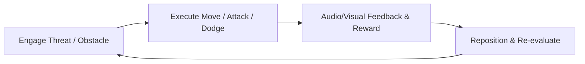

# [Game Title] — Game Design Document (GDD)

**Version**: 1.0  
**Author**: Game Designer  
**Lead Approvals**: Producer, Lead Programmer, Art Director  
**Target Platform**: [PC / Console / Mobile / Web]  
**Genre**: [e.g. Action Roguelite, Isometric RPG, Platformer]

---

## 1. Executive Summary & Pillars

### 1.1 High Concept & Pitch
- **One-Sentence Hook**: [A punchy sentence describing the core fantasy and unique selling proposition].
- **Setting & Premise**: [Brief summary of the world, era, and player character's role].

### 1.2 Core Pillars
1. **[Pillar 1 - e.g. Dynamic Momentum]**: [Description of what this pillar means for mechanics].
2. **[Pillar 2 - e.g. Meaningful Synergies]**: [Description of build crafting / depth].
3. **[Pillar 3 - e.g. High-Stakes Exploration]**: [Description of risk vs. reward].

---

## 2. Core Gameplay Loops

### 2.1 The 30-Second Loop

### 2.2 The 10-Minute Loop (Mission / Level)
- Ingress $\rightarrow$ Explore / Combat Arenas $\rightarrow$ Mini-Boss / Objective $\rightarrow$ Loot / Upgrade $\rightarrow$ Egress.

### 2.3 The Meta-Game Loop
- Run completion/death $\rightarrow$ Base Camp / Skill Tree unlock $\rightarrow$ Loadout selection $\rightarrow$ New run with permanent progression.

---

## 3. Core Mechanics & Player Capabilities

### 3.1 Character Controller & Locomotion
| Action | Input (Gamepad / KBM) | Mechanics Detail | Tunable Parameters |
| :--- | :--- | :--- | :--- |
| **Walk / Run** | Left Stick / WASD | Analog acceleration with turn smoothing | `move_speed`, `acceleration`, `friction` |
| **Jump** | A Button / Space | Variable height, coyote time (80ms), buffer (100ms) | `jump_force`, `gravity_scale`, `fall_multiplier` |
| **Dash / Dodge** | B Button / Shift | Invulnerability frames (150ms), directional burst | `dash_distance`, `dash_cooldown`, `iframes_duration` |

### 3.2 Combat / Interaction Systems
- **Primary Action**: [Description of standard attack, timing, hitbox duration].
- **Secondary Action**: [Description of utility, parry, or heavy action].
- **Resource Management**: [Health, Stamina, Mana, Ammo, Cooldowns].

---

## 4. Systems, Economy & Progression

### 4.1 Stats & Mathematical Formulas
- **Damage Formula**:
  $$\text{Damage} = \text{BaseDamage} \times \left(1 + \frac{\text{Power}}{100}\right) - \text{ArmorFlat}$$
- **Progression Scaling**: XP curve and level scaling factors.

### 4.2 Economy Balancing
- **Faucets (Inflow)**: Enemy drops, chest loot, quest completions.
- **Sinks (Outflow)**: Shop purchases, weapon upgrades, death penalties.

---

## 5. User Interface & Audio-Visual Feedback

- **HUD Elements**: Health bar, active weapon slot, mini-map, objective tracker.
- **Juice & Feel**: Screen shake thresholds, hit-stop frames (freeze-frames on hit: 3-5 frames), chromatic aberration pulses.

---

## 6. Milestones & Feature Roadmap

- [ ] **M0 - Prototype**: Graybox arena, responsive player controller, basic enemy dummy.
- [ ] **M1 - First Playable**: 3 enemy archetypes, 1 functional weapon, basic combat loop.
- [ ] **M2 - Vertical Slice**: 1 fully art-dressed level, boss fight, complete audio/VFX pass.
- [ ] **M3 - Content Complete (Beta)**: All levels, narrative dialogues, full progression tree.
- [ ] **M4 - Polish & Release (Gold Master)**: Zero P0/P1 bugs, locked 60 FPS, localization.
