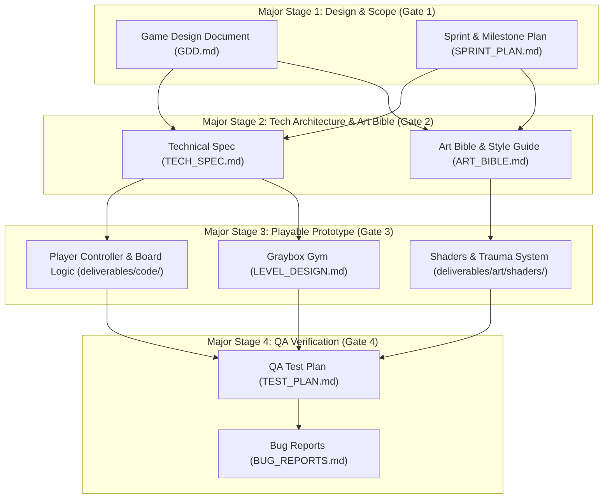

# Runes of the Avatar: Shards of Virtue — Sprint & Milestone Plan

**Project**: Runes of the Avatar: Shards of Virtue  
**Sprint Cycle**: Sprint 1 (Weeks 1–2, 10 Working Days)  
**Owner / Author**: Producer (GameDevTeam Studio Orchestration)  
**Approved By**: Game Designer, Lead Programmer, Art Director  
**Target Milestone**: Milestone 0 (M0 - Prototype Core & Simulation Foundation)  
**Pipeline Stage**: Major Stage 1: Design & Scope (Gate 1 Deliverable)  

---

## 1. Executive Summary & Milestone Roadmap (M0 to M4)

### 1.1 Executive Overview & Scope Mandate
*Runes of the Avatar: Shards of Virtue* synthesizes classic top-down tile-based exploration and the ethical virtue systems of *Ultima IV–VII* with the cascade-driven tactical depth of *Bejeweled*. 

As Producer, the primary directive for **Sprint 1** is establishing a decoupled, deterministic technical foundation while locking down cross-functional visual, spatial, and mechanical standards. Sprint 1 focuses on:
1. **Decoupled Headless Simulation**: Building the pure mathematical 8x8 match-3 engine (`RunicBoardModel`) separate from any graphical rendering layer, enabling 100% automated regression test coverage before UI hookups.
2. **Deterministic Tile Locomotion**: Delivering a 32px grid-based character controller with 160ms smooth tween interpolation and 120ms input buffering in a graybox test arena.
3. **Turn & AP Economy Validation**: Implementing the 2-Action-Point turn loop, physical Blade matching, Armor Barrier Shield absorption, and telegraph intent dials for a baseline prototype encounter.
4. **Visual & Accessibility Baseline**: Establishing high-contrast silhouette shapes and stained-glass color palettes for all 6 core rune types to ensure immediate colorblind readability.

### 1.2 Master Milestone Schedule (M0 to M4)

| Milestone | Target Dates | Focus & Deliverables | Primary Roles Involved | Gate Sign-Off Criteria | Risk Level |
| :--- | :--- | :--- | :--- | :--- | :--- |
| **M0: Prototype Core** | Weeks 1–2 *(Current)* | Headless 8x8 match-3 simulation model; 2D tile locomotion gym; basic Blade/Shield resolution; 6 rune silhouettes; automated unit test harness. | Lead Prog, Gameplay Dev, Tech Artist, Level Des, Art Dir, QA | Headless match engine passes 100% cascade tests; locomotion verified at 60 FPS with zero clipping. | Low |
| **M1: First Playable** | Weeks 3–5 | Dual-viewport UI integration; overland-to-combat transition state machine; 3 monster archetypes with intent dials; Reagent Satchel & 3 Circle-1 spells; save/load serialization. | Lead Prog, Gameplay Dev, Art Dir, Tech Artist, QA | Complete loop: overland explore -> combat encounter -> defeat monster -> collect loot -> return to explore. | Medium |
| **M2: Vertical Slice** | Weeks 6–9 | Province of Britain (Castle Britannia, Britain Township, Dungeon Despise floor 1); 3 companions (Avatar, Iolo, Jaana); 6 reagent spells; Shrine of Compassion trial; full pixel art pass & dynamic lighting. | All Disciplines | 45-minute continuous polished gameplay loop presented to stakeholders; zero P0/P1 defects. | High |
| **M3: Content Complete (Beta)** | Weeks 10–14 | 8 Virtue Shrines, 8 Dungeons, continental Britannia map; 8 fellowship heroes; 24 spells across 4 circles; twin moons (Trammel & Felucca); Shadowlords & Stygian Abyss. | All Disciplines | Feature-complete content lock; all narrative quests & Virtue catechisms fully functional. | High |
| **M4: Polish & Gold Master** | Weeks 15–16 | Steam Deck & Nintendo Switch 60 FPS optimization; complete audio orchestration pass; full accessibility options; final QA certification. | Lead Prog, Tech Art, QA, Producer | 0 open P0/P1 bugs; performance passes certification checklists across target platforms. | Medium |

### 1.3 Estimation Scale & Capacity Model
- **Story Point Estimation**: Modified Fibonacci sequence (1, 2, 3, 5, 8, 13).
  - **1 Point**: Trivial task (< 0.5 day); low complexity, well-defined pattern.
  - **2 Points**: Standard minor task (0.5 – 1 day); clear implementation path.
  - **3 Points**: Medium task (1 – 2 days); standard engineering/art component with known dependencies.
  - **5 Points**: Complex task (2 – 3 days); cross-discipline integration or algorithmic depth.
  - **8 Points**: Major architectural epic (3 – 5 days); requires decomposition into subtasks.
  - **13 Points**: Blocker epic (> 5 days); MUST be broken down before sprint commitment.
- **Sprint 1 Team Capacity**: 8 full-time equivalent (FTE) contributors × 10 working days = 80 person-days (target planned velocity: 52 Story Points with 25% buffer for exploratory prototyping and QA cycles).

---

## 2. Sprint 1: Prototype Core Goals & High-Level Objectives

- **Goal 1 (Simulation Core)**: Build a 100% deterministic, headless 8x8 match-3 simulation class (`RunicBoardModel`) that handles swap validation, match-3/4/5 detection, gravity drop, cascade resolution, and event broadcasting without any UI or rendering dependencies.
- **Goal 2 (Exploration Mechanics)**: Implement the 2D tile locomotion controller (`PlayerController`) with smooth 160ms step interpolation, 32px grid snapping, 120ms input buffering, and raycast interaction in a dedicated graybox gym.
- **Goal 3 (Combat & AP Economy Loop)**: Stand up the core combat math loop: 2 base Action Points (AP), tile swap cost, Blade damage calculation with cascade multipliers, Shield barrier absorption, and telegraph intent dials for a prototype enemy dummy.
- **Goal 4 (Visual Language & Accessibility)**: Author the comprehensive Art Bible (`ART_BIBLE.md`) and establish high-contrast, distinct silhouettes and color hex standards for the 6 core runes (Blades, Shields, Bloodmoss, Mandrake, Skulls, Virtue Shards) to ensure immediate colorblind readability.
- **Goal 5 (Game Feel & Tech Art Baseline)**: Implement the screen shake trauma decay model ($Trauma = \max(0, Trauma - 1.8 \Delta t)$), gem-pop scale tween (0.15s @ 1.25x), particle burst triggers, and draw call profiling baseline for 60 FPS execution.
- **Goal 6 (Automated QA Harness)**: Establish a comprehensive unit test suite in `deliverables/code/tests/` verifying match detection, cascade multipliers, AP consumption, and edge-case gravity drops (L-shapes, T-shapes, multi-line matches).

---

## 3. Cross-Functional Task Assignment Matrix

| Task ID | Priority | Discipline | Assignee | Task Description | Dependencies | Est. (Pts / Days) | Deliverable Target | Status |
| :--- | :--- | :--- | :--- | :--- | :--- | :--- | :--- | :--- |
| **TSK-PRD-01** | P0 | Production | Producer | Formulate Sprint 1 Plan, milestone roadmap, and Jira/Git task tracking setup | None | 2 pts / 1d | `deliverables/docs/SPRINT_PLAN.md` | In Progress |
| **TSK-ENG-01** | P0 | Tech Lead | Lead Programmer | Author Technical Architecture Specification (`TECH_SPEC.md`): engine selection, state machine patterns, memory budgets | None | 5 pts / 2.5d | `deliverables/docs/TECH_SPEC.md` | Pending |
| **TSK-ART-01** | P0 | Art Lead | Art Director | Author Visual Bible & Mood Board (`ART_BIBLE.md`): 16-bit CRPG aesthetic, lighting rules, color palettes | None | 5 pts / 2.5d | `deliverables/art/ART_BIBLE.md` | Pending |
| **TSK-ENG-02** | P0 | Tech Lead | Lead Programmer | Implement headless `RunicBoardModel`: 8x8 matrix, swap logic, match detection, gravity fall algorithm | TSK-ENG-01 | 5 pts / 2.5d | `deliverables/code/src/systems/runic_board_model.py` | Pending |
| **TSK-ENG-03** | P1 | Tech Lead | Lead Programmer | Build data-driven JSON schema & loader for runes, spells, and monster stats | TSK-ENG-01 | 3 pts / 1.5d | `deliverables/code/src/data/` | Pending |
| **TSK-GPL-01** | P0 | Gameplay | Gameplay Dev | Implement 2D Grid Locomotion Controller: 32px snapping, 160ms step tween, 120ms input buffer | TSK-ENG-01 | 5 pts / 2.5d | `deliverables/code/src/controllers/player_controller.py` | Pending |
| **TSK-GPL-02** | P1 | Gameplay | Gameplay Dev | Implement directional interaction raycaster (1 tile ahead) for NPCs, chests, and pushable blocks | TSK-GPL-01 | 3 pts / 1.5d | `deliverables/code/src/controllers/interaction_controller.py` | Pending |
| **TSK-GPL-03** | P0 | Gameplay | Gameplay Dev | Implement Combat Turn Controller & AP Economy: 2 base AP, swap costs, cascade bonus AP triggers | TSK-ENG-02 | 5 pts / 2.5d | `deliverables/code/src/systems/combat_turn_manager.py` | Pending |
| **TSK-GPL-04** | P1 | Gameplay | Gameplay Dev | Implement damage & barrier resolution formulas (Blade damage, Shield Block Points, Enemy Intent tick) | TSK-GPL-03 | 3 pts / 1.5d | `deliverables/code/src/systems/combat_resolver.py` | Pending |
| **TSK-LVL-01** | P1 | Level Des | Level Designer | Author Graybox Test Arena Specification (`LEVEL_DESIGN.md`): gym layout, collision boundaries, metrics | None | 3 pts / 1.5d | `deliverables/docs/LEVEL_DESIGN.md` | Pending |
| **TSK-LVL-02** | P1 | Level Des | Level Designer | Graybox Locomotion Gym Blockout: walking paths, narrow corridors, pushable block test zone | TSK-LVL-01 | 3 pts / 1.5d | `deliverables/code/assets/levels/graybox_gym.json` | Pending |
| **TSK-ART-02** | P0 | Art Lead | Art Director | Author 6-Rune Silhouette & Colorway Matrix: Blade, Shield, Bloodmoss, Mandrake, Skull, Virtue Shard | TSK-ART-01 | 3 pts / 1.5d | `deliverables/art/runes/` | Pending |
| **TSK-ART-03** | P1 | Art Lead | Art Director | Design Dual-Viewport UI Layout Concept: 16:9 PC & 16:10 Steam Deck aspect ratio wireframes | TSK-ART-01 | 3 pts / 1.5d | `deliverables/art/ui/dual_viewport_layout.png` | Pending |
| **TSK-ART-04** | P2 | Art Lead | Art Director | Concept sprite sheets for 3 prototype monsters (Orc Grunt, Skeleton Warrior, Evil Mage) | TSK-ART-01 | 5 pts / 2.5d | `deliverables/art/monsters/` | Pending |
| **TSK-TXT-01** | P1 | Tech Art | Technical Artist | Author Master Pixel Art & Stained-Glass Shader Baseline; define draw call performance budgets | TSK-ART-01 | 5 pts / 2.5d | `deliverables/art/shaders/` | Pending |
| **TSK-TXT-02** | P1 | Tech Art | Technical Artist | Implement Screen Shake Trauma System ($Trauma = \max(0, Trauma - 1.8 \Delta t)$) & hitstop triggers | TSK-ENG-01 | 3 pts / 1.5d | `deliverables/code/src/systems/trauma_manager.py` | Pending |
| **TSK-TXT-03** | P2 | Tech Art | Technical Artist | Author Gem Pop & Cascade Particle Burst Effects (12 particles, 400px/s velocity, gem-tinted) | TSK-ART-02 | 3 pts / 1.5d | `deliverables/art/vfx/gem_particles/` | Pending |
| **TSK-NAR-01** | P2 | Narrative | Narrative Des | Draft Britannia Lore Primer & Eightfold Virtue Catechism dialogue trees (Honesty through Humility) | None | 3 pts / 1.5d | `deliverables/docs/NARRATIVE_BIBLE.md` | Pending |
| **TSK-NAR-02** | P2 | Narrative | Narrative Des | Define Keyword Parsing Grammar & Dictionary (NAME, JOB, JOIN, VIRTUE, RUNE, BYE) | None | 2 pts / 1d | `deliverables/code/src/data/dialogue_keywords.json` | Pending |
| **TSK-QAT-01** | P0 | QA | QA Playtester | Formulate Prototype Test Suite (`TEST_PLAN.md`): match verification, physics bounds, input buffer | TSK-ENG-01 | 3 pts / 1.5d | `deliverables/qa/TEST_PLAN.md` | Pending |
| **TSK-QAT-02** | P0 | QA | QA Playtester | Implement Automated Unit Test Harness for `RunicBoardModel` (cascades, combos, edge cases) | TSK-ENG-02 | 5 pts / 2.5d | `deliverables/code/tests/test_runic_board.py` | Pending |
| **TSK-QAT-03** | P1 | QA | QA Playtester | Execute Locomotion & Combat Smoke Test; log defects in Bug Tracker (`BUG_REPORTS.md`) | TSK-GPL-01, TSK-GPL-03 | 3 pts / 1.5d | `deliverables/qa/BUG_REPORTS.md` | Pending |
| **TSK-PRD-02** | P1 | Production | Producer | Coordinate Stage 1 Gate Sign-Off and facilitate Stage 2 handoff to Tech Lead and Art Director | All Sprint 1 | 2 pts / 1d | `deliverables/docs/PROJECT_DASHBOARD.md` | Pending |

---

## 4. Detailed Discipline Work Breakdown Structure (WBS) & Acceptance Criteria

---

### 4.1 Lead Programmer (`lead-programmer`)

#### Objective
Establish the foundational technical architecture, runtime loop, state machine architecture, and headless simulation models to ensure the core game mechanics can be verified with automated unit tests prior to frontend visual integration.

#### Detailed Task Breakdown
1. **TSK-ENG-01: Technical Architecture Specification (`deliverables/docs/TECH_SPEC.md`)**
   - Define runtime environment: Python 3.10+ / Pygame-CE (or modern lightweight canvas/headless runtime) targeting 60 FPS deterministic updates.
   - Specify Entity-Component-System (ECS) or clean object-oriented FSM architecture separating Game State, Simulation Engine, and Presentation View.
   - Document fixed timestep physics/locomotion loop ($dt = 0.0166\text{s}$) with accumulator pattern to eliminate frame-rate dependent locomotion drift.
   - Define performance budgets: Memory footprint $< 250\text{MB}$, draw calls $< 45$ per frame, CPU frame budget $< 8\text{ms}$, garbage collection pause $< 1\text{ms}$.
   - Specify headless simulation interface (`RunicBoardModel`) and publish-subscribe event bus (`GameEventBus`).
2. **TSK-ENG-02: Headless 8x8 Match-3 Simulation Engine (`runic_board_model.py`)**
   - Implement an $8 \times 8$ matrix storing rune instances (`RuneType`: BLADE, SHIELD, BLOODMOSS, MANDRAKE, SKULL, VIRTUE_SHARD).
   - Implement `is_valid_swap(x1, y1, x2, y2) -> bool` validating orthogonal adjacency and verifying that the swap produces at least one match of 3 or more gems.
   - Implement `find_all_matches() -> List[MatchGroup]` detecting horizontal, vertical, L-shape, and T-shape matches.
   - Implement `resolve_gravity_step() -> GravityStepResult` executing top-to-bottom tile drops and spawning new randomized runes into top-row voids using seedable PRNG.
   - Implement `cascade_loop() -> CascadeReport` cycling match -> remove -> gravity until the board reaches stable equilibrium, computing `cascade_count` and scoring multipliers.
3. **TSK-ENG-03: Data-Driven Schema & Configuration Registry (`src/data/`)**
   - Author JSON schemas for `runes.json`, `combat_formulas.json`, and `monsters.json`.
   - Implement robust JSON loaders with schema validation and default fallbacks.

#### Acceptance Criteria
- [ ] `TECH_SPEC.md` authored with complete architecture diagrams, state machines, and frame budgets.
- [ ] `RunicBoardModel` runs completely headless with 0 graphical library dependencies.
- [ ] `is_valid_swap()` returns `False` for non-matching swaps and reverts board state without side effects.
- [ ] Deterministic PRNG seed produces 100% reproducible board configurations and drop cascades across test runs.
- [ ] `cascade_loop()` correctly detects match-3, match-4, match-5, and intersecting L/T matches, firing typed events (`OnMatchFound`, `OnGravityStep`, `OnCascadeComplete`).
- [ ] All formulas from GDD Section 4.1 implemented as data-driven functions with zero hardcoded magic numbers.

---

### 4.2 Gameplay & Systems Programmer (`gameplay-programmer`)

#### Objective
Implement the player exploration character controller, grid movement interpolation, interaction mechanics, and turn-based combat resolution loop adhering to the GDD specifications.

#### Detailed Task Breakdown
1. **TSK-GPL-01: 2D Grid Locomotion Controller (`player_controller.py`)**
   - Implement deterministic 32px grid-aligned locomotion with 4-directional cardinal movement (Up, Down, Left, Right).
   - Implement smooth step tween interpolation ($t_{\text{step}} = 160\text{ms}$) utilizing sinusoidal ease-out motion.
   - Implement a 120ms FIFO input buffer: if the player inputs a directional command while mid-step, buffer the input and execute immediately upon grid cell entry without stopping.
   - Prevent diagonal movement and corner snagging via strict single-axis input prioritization.
   - Implement sprint toggle holding Right Trigger / Shift accelerating tile traversal by $1.6\times$ ($100\text{ms}$ step duration).
2. **TSK-GPL-02: Interaction Raycaster & Pushable Block Mechanics (`interaction_controller.py`)**
   - Implement directional forward raycast (distance: exactly 1.0 tile in facing direction) upon pressing Interact (A Button / Spacebar / E).
   - Detect targets: `Signpost`, `Chest`, `Door`, `NPC`, `MovableBlock`.
   - Implement block pushing: when pressing directional key against a `MovableBlock`, require a 250ms sustained hold before initiating a smooth 1-tile block slide into empty space; block movement if destination tile has collision.
3. **TSK-GPL-03: Combat Turn Manager & Action Point Economy (`combat_turn_manager.py`)**
   - Manage turn lifecycle: `PlayerTurnStart` -> `PlayerActionPhase` -> `CascadeResolutionPhase` -> `EnemyActionPhase` -> `TurnEnd`.
   - Allocate 2 base AP at start of player turn. Deduct 1 AP per valid tile swap.
   - Award +1 bonus AP when a cascade combo reaches $4\times$ or higher (capped at +2 bonus AP per turn).
   - Transition to `EnemyActionPhase` automatically when AP drops to 0.
4. **TSK-GPL-04: Combat Damage & Barrier Resolver (`combat_resolver.py`)**
   - Implement Physical Blade damage formula:
     $$\text{Damage}_{\text{phys}} = \left(\text{BaseWeaponPower} + (\text{BladesMatched} \times \text{BladeTierMultiplier})\right) \times \left(1 + \frac{\text{HeroStrength}}{50}\right) \times \text{CascadeMultiplier} \times \left(\frac{100}{100 + \text{EnemyArmor}}\right)$$
   - Implement Shield Armor Barrier formula:
     $$\text{ShieldGained} = (\text{ShieldsMatched} \times 8) \times \left(1 + \frac{\text{HeroConstitution}}{60}\right) + \text{EquippedShieldDefense}$$
   - Apply incoming enemy intent damage against Shield Barrier first; subtract overflow from player party HP.

#### Acceptance Criteria
- [ ] Player controller moves strictly on a 32px grid with smooth 160ms interpolation and 0 sub-pixel jitter.
- [ ] 120ms input buffer verified: rapid directional taps queue subsequent steps seamlessly without hitching.
- [ ] Pushing blocks requires a 250ms hold delay; push fails if destination tile is obstructed.
- [ ] Player starts combat turn with 2 AP; valid swap costs exactly 1 AP; 4x cascade awards +1 AP.
- [ ] Zero AP locks player input and passes turn to Enemy Action Phase.
- [ ] Damage and Shield calculations match mathematical test vectors defined in GDD Section 4.1 within $0.01$ floating-point accuracy.

---

### 4.3 Art Director (`art-director`)

#### Objective
Define the visual identity, art direction bible, high-contrast color palettes, and distinct rune shape language to achieve a rich 16-bit CRPG aesthetic reminiscent of *Ultima VII* combined with luminous stained-glass gems that guarantee colorblind accessibility.

#### Detailed Task Breakdown
1. **TSK-ART-01: Master Visual Bible & Style Guide (`deliverables/art/ART_BIBLE.md`)**
   - Define the visual pillars: *Gothic Britannian Heritage*, *Luminous Stained-Glass Runic Mysticism*, *Tactile Micro-Dioramas*.
   - Detail lighting and environmental mood rules: torchlight falloff, ambient occlusion in pixel art, vignette framing.
   - Establish authoritative color palette tables (RGB & Hex) for UI, environment, lighting, and virtue runes.
   - Document pixel density and asset resolution rules: $32 \times 32$ world tiles, $48 \times 48$ runic board jewels, $64 \times 64$ combat monster battlers.
2. **TSK-ART-02: 6-Rune Silhouette & High-Contrast Colorway Matrix (`deliverables/art/runes/`)**
   - Design unmistakable silhouette shapes and color profiles for each core rune:
     - **Blades**: Steel Silver (`#D6E4F0`), sharp elongated diamond contour with dual-bladed crossguard silhouette.
     - **Shields**: Iron / Deep Azure (`#2C5D88`), wide gothic kite shield with raised boss silhouette.
     - **Bloodmoss**: Emerald Green (`#2EB056`), organic four-leaf herbal rosette silhouette.
     - **Mandrake / Aether**: Arcane Amethyst (`#9C42D6`), crystalline root cluster with radiating mana flare.
     - **Skulls & Gold**: Burnished Gold / Bone (`#E5A93C` / `#FAF0D7`), crowned human skull silhouette.
     - **Virtue Shards**: Prismatic Opal (`#F7E8AA` pulsing through chromatic spectrum), octagonal multifaceted star diamond.
   - Validate silhouettes in grayscale / monochrome to guarantee 100% colorblind accessibility without color cue reliance.
3. **TSK-ART-03: Dual-Viewport UI Layout Concept & Wireframes (`deliverables/art/ui/`)**
   - Author wireframe specifications for the 16:9 PC display ($1920 \times 1080$) and 16:10 Steam Deck display ($1280 \times 800$).
   - Layout the Top Viewport (Tactical Diorama: party sprites, enemy battlers, intent dials, status pips) and Bottom Viewport (8x8 Runic Matrix: stone frame, reagent satchel counters, AP pips, spell quickbar).
4. **TSK-ART-04: Concept Sprite Sheets for 3 Prototype Monsters (`deliverables/art/monsters/`)**
   - Author design sheets for **Orc Grunt** (physical melee brute), **Skeleton Warrior** (shielded undead with curse intent), and **Evil Mage** (ranged sorcerer with elemental spell charge).
   - Specify telegraph intent icons: Sword Slash, Curse Skull Countdown, Fireball Charging Dial.

#### Acceptance Criteria
- [ ] `ART_BIBLE.md` fully authored with color hex tables, silhouette design rules, and sprite resolution standards.
- [ ] All 6 core runes possess radically distinct outer silhouettes distinguishable in pure black-and-white silhouette mode.
- [ ] UI layout wireframes specify exact pixel coordinate boundaries for both 16:9 (PC) and 16:10 (Steam Deck) screens.
- [ ] Visual intent icons (Attack, Curse, Charge) documented with clear color and silhouette differentiation.

---

### 4.4 Technical Artist (`technical-artist`)

#### Objective
Bridge the gap between art direction and engineering by authoring performant shaders, implementing the screen shake trauma model, tuning particle burst visual effects, and profiling GPU/CPU performance budgets.

#### Detailed Task Breakdown
1. **TSK-TXT-01: Master Pixel Art & Stained-Glass Shaders (`deliverables/art/shaders/`)**
   - Author master palette-swapping and luminosity enhancement shader for runic tiles.
   - Implement an inner specular gleam shader for matched gems creating a stained-glass luminescence effect.
   - Author a 2D radial torchlight darkness shader with soft dithering falloff for dungeon exploration mode.
   - Enforce draw call budget: batch all board tile draws into a single texture atlas to keep draw calls $\le 12$ for the combat view.
2. **TSK-TXT-02: Screen Shake Trauma System (`src/systems/trauma_manager.py`)**
   - Implement normalized trauma accumulator ($\text{Trauma} \in [0.0, 1.0]$).
   - Implement linear trauma decay: $\text{Trauma} = \max(0, \text{Trauma} - 1.8 \times \Delta t)$.
   - Calculate camera displacement offsets using non-linear squaring:
     $$X = \text{Trauma}^2 \times \text{MaxOffset}_X \times \text{Random}(-1, 1)$$
     $$Y = \text{Trauma}^2 \times \text{MaxOffset}_Y \times \text{Random}(-1, 1)$$
     $$\text{Angle} = \text{Trauma}^2 \times \text{MaxAngle} \times \text{Random}(-1, 1)$$
   - Expose tuning parameters: `trauma_decay_rate`, `max_offset_x`, `max_offset_y`, `max_angle`.
   - Provide trauma triggers: 3-Match ($+0.05$), 4-Match Cleave ($+0.18$), 5-Match Avatar Nova ($+0.45$), Enemy Strike ($+0.25$).
3. **TSK-TXT-03: Gem Pop & Cascade Particle VFX (`deliverables/art/vfx/`)**
   - Implement particle burst spawner: 12 gem-tinted particles on 3-match, 24 particles on 4-match.
   - Radial velocity dispersion ($400\text{px/s}$) with gravity deceleration ($600\text{px/s}^2$) and scale fade over $0.25\text{s}$.
   - Add micro-hitstop freeze trigger (5 frames / $83\text{ms}$) on Avatar 5-match clear.

#### Acceptance Criteria
- [ ] Shaders execute within $1.5\text{ms}$ GPU budget per frame on integrated Intel UHD / Steam Deck targets.
- [ ] Trauma manager smoothly decays trauma to 0 with zero residual camera offset or drift.
- [ ] Screen shake parameters fully decoupled into editable data configuration (`data/camera_trauma.json`).
- [ ] Particle systems employ object pooling (pre-allocated pool of 128 particles) to prevent garbage collection allocation spikes during cascades.

---

### 4.5 Level & Environment Designer (`level-designer`)

#### Objective
Design the spatial mechanics, collision bounding, and layout of the prototype graybox test arena to validate player movement, obstacle pushing, interaction triggers, and combat encounter transitions.

#### Detailed Task Breakdown
1. **TSK-LVL-01: Graybox Movement Test Arena Specification (`deliverables/docs/LEVEL_DESIGN.md`)**
   - Define standard spatial metrics: player height = 32px, standard passage width = 1 tile (32px), wide hall = 3 tiles (96px), door opening = 1 tile.
   - Design functional test zones within a single continuous $40 \times 40$ tile test level:
     - **Zone A: Movement Calibration Strip** (linear walking corridors, sprint track, narrow 1-tile chicanes to test cornering).
     - **Zone B: Obstacle & Push Block Gym** (single movable block, block against wall test, 3-block sequence puzzle).
     - **Zone C: Interactive Object Bank** (chest, locked door, lever, signpost, NPC standing zone).
     - **Zone D: Encounter Trigger Zone** (hostile patrolling dummy triggering seamless transition to Combat Board).
2. **TSK-LVL-02: Level Data Serialization & Map Blockout (`assets/levels/graybox_gym.json`)**
   - Export level layout in JSON format containing 2D layer arrays: `ground`, `walls`, `objects`, `triggers`.
   - Embed metadata coordinates for player spawn, interactive object IDs, and collision flags.

#### Acceptance Criteria
- [ ] `LEVEL_DESIGN.md` authored detailing metric budgets, tile collision rules, and zone layout maps.
- [ ] `graybox_gym.json` serialized with valid coordinates and layer definitions.
- [ ] Movement corridors validate that 1-tile gaps allow passage with 0 diagonal jamming or clipping.
- [ ] Pushable block zone layout includes both valid pushing destinations and boundary constraints preventing blocks from being pushed out of world bounds.

---

### 4.6 Narrative & Quest Designer (`narrative-designer`)

#### Objective
Establish the narrative bible, Eightfold Virtue moral philosophy, and keyword-driven dialogue grammar that distinguishes this game as a true successor to *Ultima*.

#### Detailed Task Breakdown
1. **TSK-NAR-01: Britannia Narrative Bible & Virtue Catechism (`deliverables/docs/NARRATIVE_BIBLE.md`)**
   - Author the world primer: The Cataclysm of the False Triad, the shattering of the Codex of Ultimate Wisdom into Virtue Runestones.
   - Detail the Eight Virtues derived from the Three Principles (Truth, Love, Courage):
     - **Honesty** (Truth), **Compassion** (Love), **Valor** (Courage).
     - **Justice** (Truth + Love), **Sacrifice** (Love + Courage), **Honor** (Truth + Courage).
     - **Spirituality** (Truth + Love + Courage), **Humility** (The independent foundation).
   - Write meditation mantras and shrine catechisms for the prototype shrine (Shrine of Compassion: mantra *"MU"*).
2. **TSK-NAR-02: Keyword Parsing Grammar & Dictionary (`src/data/dialogue_keywords.json`)**
   - Define keyword parser dictionary for standard Britannian NPCs: `NAME`, `JOB`, `JOIN`, `VIRTUE`, `RUNE`, `BYE`.
   - Author prototype NPC dialogue scripts for Lord British's herald and an injured shepherd near Britain.

#### Acceptance Criteria
- [ ] `NARRATIVE_BIBLE.md` fully authored with world history, virtue philosophical tenets, and shrine trial dialogue.
- [ ] `dialogue_keywords.json` authored with exact keyword matches, synonyms, and conversational fallback responses.

---

### 4.7 QA & Playtesting Engineer (`qa-playtester`)

#### Objective
Formulate the comprehensive test plan, implement automated headless testing harnesses for the match-3 cascade engine, and validate player movement feel and edge-case boundaries.

#### Detailed Task Breakdown
1. **TSK-QAT-01: Prototype Test Suite Specification (`deliverables/qa/TEST_PLAN.md`)**
   - Author functional test matrix covering:
     - 8x8 Grid boundary swaps (corners, edges, center).
     - Invalid swap rejection and board reversion.
     - Multi-match simultaneous cascade resolution.
     - Action point deduction and cascade bonus AP triggers.
     - Grid locomotion step interpolation and input buffering.
     - Damage and barrier formula calculation verification.
2. **TSK-QAT-02: Automated Headless Match-3 Test Suite (`tests/test_runic_board.py`)**
   - Implement unit tests using standard Python `unittest` / `pytest`:
     - `test_valid_horizontal_swap_triggers_match()`
     - `test_invalid_swap_reverts_state()`
     - `test_l_shape_and_t_shape_matches()`
     - `test_cascade_chain_increments_multiplier()`
     - `test_gravity_fills_empty_cells_without_gaps()`
     - `test_avatar_5_match_generates_prismatic_gem()`
     - `test_deterministic_seed_generates_identical_sequence()`
3. **TSK-QAT-03: Locomotion Feel & Smoke Test Execution (`deliverables/qa/BUG_REPORTS.md`)**
   - Conduct manual input buffer stress testing (rapid KBM and gamepad input hammering).
   - Verify 0 dropped frames or camera jitter during diagonal collision sliding.
   - Record and log any discovered defects into `BUG_REPORTS.md` with repro steps and severity triage.

#### Acceptance Criteria
- [ ] `TEST_PLAN.md` authored with test case IDs, preconditions, execution steps, and expected results.
- [ ] `test_runic_board.py` executes 100% passing across all headless match, cascade, and gravity unit tests.
- [ ] Edge cases tested: simultaneous horizontal + vertical matches, board-clearing combos, and corner tile swaps.
- [ ] `BUG_REPORTS.md` initialized with standardized defect logging template and zero unresolved P0/P1 bugs.

---

### 4.8 Producer (`producer`)

#### Objective
Ensure overall team alignment, enforce milestone timelines, unblock inter-disciplinary dependencies, track velocity, and maintain production governance across the 4 major stages.

#### Detailed Task Breakdown
1. **TSK-PRD-01: Production Setup & Sprint Backlog Authoring (`deliverables/docs/SPRINT_PLAN.md`)**
   - Deconstruct GDD into granular, role-specific sprint tasks with story points and dependencies.
   - Establish milestone roadmaps (M0 to M4) and quality gates.
2. **TSK-PRD-02: Blocker Triage & Stage 1 Sign-Off Management (`deliverables/docs/PROJECT_DASHBOARD.md`)**
   - Maintain daily status updates in `PROJECT_DASHBOARD.md`.
   - Coordinate review gate between Game Designer (GDD) and Producer (Sprint Plan).
   - Prepare briefing documents for Lead Programmer and Art Director to unlock Major Stage 2.

#### Acceptance Criteria
- [ ] `SPRINT_PLAN.md` authored replacing all placeholders with production-grade task specifications.
- [ ] All cross-discipline dependencies clearly mapped with 0 circular dependencies.
- [ ] Dashboard updated reflecting Step 2 completion and Stage 1 Gate readiness.

---

## 5. Sprint 2 Horizon Backlog (Milestone 1 — First Playable)

The following features and epics are queued for **Sprint 2** (Weeks 3–5), transitioning the project from isolated prototype mechanics to the **M1: First Playable** continuous vertical loop:

| Task ID | Discipline | Assignee | Task Description | Dependencies | Est. (Pts) |
| :--- | :--- | :--- | :--- | :--- | :--- |
| **TSK-M1-01** | Tech Lead | Lead Programmer | Implement Overland-to-Combat Transition State Machine & Viewport Switcher | TSK-ENG-02, TSK-GPL-01 | 5 pts |
| **TSK-M1-02** | Gameplay | Gameplay Dev | Implement Full 6-Rune Match-4 & Match-5 Special Behaviors (Cleave, Bastion, Elixir, Avatar's Eye) | TSK-ENG-02 | 5 pts |
| **TSK-M1-03** | Gameplay | Gameplay Dev | Implement Reagent Satchel harvesting and Spellcasting UI for 3 Circle-1 Spells (*In Mani*, *Vas Flam*, *An Ex Por*) | TSK-GPL-03 | 5 pts |
| **TSK-M1-04** | Tech Lead | Lead Programmer | Implement 3 Monster AI Intent FSMs (Orc Grunt Melee, Skeleton Shield/Curse, Evil Mage Charge) | TSK-GPL-04 | 5 pts |
| **TSK-M1-05** | Tech Art | Technical Artist | Author Dual-Viewport Rendering Composition & Camera Transition Tween | TSK-ART-03, TSK-TXT-01 | 5 pts |
| **TSK-M1-06** | Level Des | Level Designer | Construct Britain Outskirts Encounter Map: roads, forest tiles, wandering monster spawners | TSK-LVL-02 | 3 pts |
| **TSK-M1-07** | Narrative | Narrative Des | Script Britain Tavern NPC dialogues using Keyword Parser (`dialogue_keywords.json`) | TSK-NAR-02 | 3 pts |
| **TSK-M1-08** | Tech Lead | Lead Programmer | Implement Game State Serialization & Save/Load Manager (party stats, inventory, karma) | TSK-ENG-01 | 5 pts |
| **TSK-M1-09** | QA | QA Playtester | Formulate End-to-End Vertical Loop Test Suite (Exploration -> Combat -> Win -> Loot) | TSK-M1-01 | 5 pts |

---

## 6. Comprehensive Risk Register & Blocker Triage Matrix

| Risk ID | Category | Description | Severity | Likelihood | Impact | Mitigation Strategy & Fallback Plan | Owner |
| :--- | :--- | :--- | :--- | :--- | :--- | :--- | :--- |
| **RSK-01** | Technical | **Simulation/Presentation Coupling**: If match-3 animations lock simulation logic, player inputs may drop during cascades or cause race conditions. | High | Medium | High | **Strict Model-View Separation**: `RunicBoardModel` runs as a pure headless mathematical class. The presentation layer (`BoardView`) subscribes to events asynchronously. Input buffering queues actions cleanly. | Lead Programmer |
| **RSK-02** | Gameplay | **Locomotion Sluggishness**: 160ms tile interpolation step might feel stiff or unresponsive to players accustomed to modern analog movement. | Medium | High | Medium | **Input Buffer & Tuning Exposure**: Implement 120ms FIFO input buffer so subsequent steps trigger without stopping; expose `step_duration` and `sprint_multiplier` in `config/locomotion.json` for live designer tuning. | Gameplay Dev |
| **RSK-03** | Art / UX | **Rune Visual Confusion**: In fast cascades or low-contrast lighting, gems may look too similar, degrading player reaction time or alienating colorblind players. | High | Medium | High | **Strict Shape Silhouette Differentiation**: Every rune must have an unmistakable geometric contour (e.g. sharp diamond for Blade, wide shield for Iron Aegis, 4-leaf rosette for Bloodmoss) verified in pure grayscale. | Art Director |
| **RSK-04** | Tech Art | **Overdraw & Frame Drops during Multi-Cascades**: Simultaneous particle bursts, screen shake, and board animations could exceed the 16.6ms frame budget on handheld devices. | High | Low | Medium | **Particle Pooling & Budgeting**: Cap active particles at 128 via pre-allocated object pool; provide performance toggle in options to disable particle physics or reduce trauma intensity. | Technical Artist |
| **RSK-05** | Level / UX | **Dual Viewport Scaling Disparity**: Top diorama and bottom runic matrix may not scale cleanly across varying aspect ratios (PC 16:9 vs Steam Deck 16:10). | Medium | High | Medium | **Fixed-Aspect Letterbox / Pillarbox Framework**: Design UI anchor system with centered 16:9 inner boundary and procedural ornate stone borders filling 16:10 margins on Steam Deck. | Art Dir / Lead Prog |
| **RSK-06** | QA | **Flaky Cascade Test Runs**: Non-deterministic gem spawns in unit tests could cause intermittent test failures. | High | Medium | High | **Seedable Mock PRNG**: Guarantee all automated unit test fixtures pass a deterministic PRNG seed or pre-defined 2D tile arrays (`mock_boards.py`) for regression testing. | QA Playtester |
| **RSK-07** | Design | **AP Economy Imbalance**: Cascade bonus AP (+1 AP on 4x combo) might trigger infinite loops if cascades chain excessively. | High | Low | High | **Hard Turn Caps**: Impose a strict ceiling of maximum +2 bonus AP per turn regardless of cascade length; test balance under stress conditions. | Game Designer / Producer |

---

## 7. Quality Gates & Definition of Done (DoD)

### 7.1 Definition of Ready (DoR) for Backlog Tasks
Before any team member begins implementation of a backlog task:
1. The task must have a clearly articulated description and direct alignment with the approved `GDD.md`.
2. All upstream dependencies must be marked as `Done` and verified.
3. Quantifiable acceptance criteria must be defined with no ambiguous placeholder language.
4. Input/output data contracts or file paths must be locked.

### 7.2 Definition of Done (DoD) for Sprint 1 Deliverables
A task is marked `Completed` only when all of the following conditions are satisfied:
- **Code Deliverables**:
  - Source code authored in `deliverables/code/` following PEP 8 / Clean Code standards.
  - Zero hardcoded game balance parameters; all values loaded from `src/data/` configuration files.
  - Accompanied by automated unit tests achieving $\ge 90\%$ branch coverage for algorithmic logic.
  - Code reviewed and approved by Lead Programmer (`lead-programmer`).
- **Art & Tech Art Deliverables**:
  - Assets placed in designated folders in `deliverables/art/`.
  - Color palettes adhere to the master hex tables in `ART_BIBLE.md`.
  - All sprites conform to defined pixel dimensions ($32 \times 32$, $48 \times 48$, $64 \times 64$).
  - Silhouettes pass accessibility validation in grayscale.
- **Design & Narrative Deliverables**:
  - Documents written to `deliverables/docs/` formatted in clean GitHub-Flavored Markdown.
  - All formulas, metrics, and keyword schemas match the master design pillars in `GDD.md`.
- **QA Deliverables**:
  - Test suites documented in `deliverables/qa/TEST_PLAN.md`.
  - Unit tests executed with 100% pass rate.
  - All discovered defects logged in `deliverables/qa/BUG_REPORTS.md` with zero open P0/P1 blockers.

### 7.3 Milestone 0 (M0) Sign-Off Gate Checklist
Prior to transitioning from Major Stage 1 into Major Stage 2 & 3:
- [x] **Game Design Document (`GDD.md`)**: Fully approved by Game Designer, Producer, Lead Programmer, and Art Director.
- [x] **Sprint & Milestone Plan (`SPRINT_PLAN.md`)**: Granular backlog established with estimates, dependencies, and risk mitigation strategies.
- [ ] **Technical Architecture Specification (`TECH_SPEC.md`)**: Ready for Lead Programmer dispatch in Major Stage 2.
- [ ] **Visual Bible & Style Guide (`ART_BIBLE.md`)**: Ready for Art Director dispatch in Major Stage 2.
- [ ] **User Gate 1 Sign-Off**: Formally presented to User / Executive Sponsor for approval.
