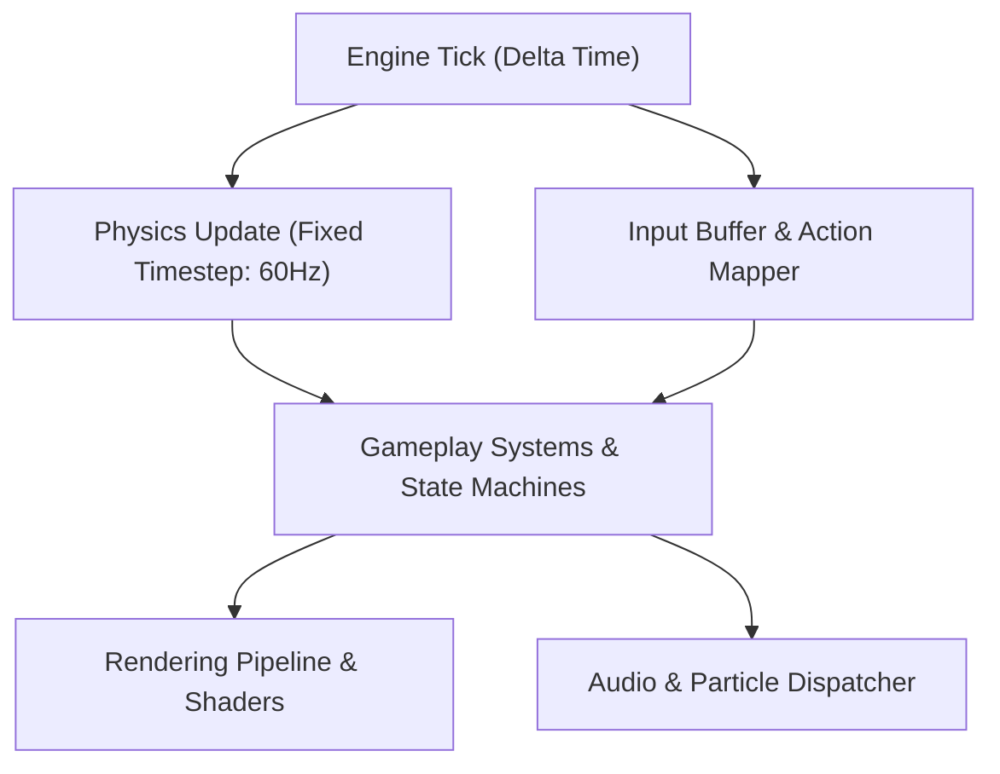

# [Game Title] — Technical Architecture Specification (Tech Spec)

**Version**: 1.0  
**Author**: Lead Programmer  
**Collaborators**: Gameplay Programmer, Technical Artist  
**Sign-off**: Producer  

---

## 1. System Architecture Overview

### 1.1 Engine & Technology Stack
- **Engine / Runtime**: [e.g. Godot 4.x / Unity 6 / Unreal Engine 5.5 / Custom Python-Raylib]
- **Target Platforms**: [PC (Windows/macOS/Linux), Console, Mobile]
- **Language & Runtime Version**: [e.g. C# .NET 8 / C++20 / GDScript / Rust / Python 3.9+]
- **Version Control & Branching**: Git Flow (`main`, `develop`, `feature/*`, `release/*`)

### 1.2 Architectural Paradigm
- **Component Model**: [Entity-Component-System (ECS) / Actor-Component / Object-Oriented Component]
- **Communication Pattern**: Event Bus / Signals / Pub-Sub to decouple systems.
- **State Management**: Hierarchical State Machines (HSM) for characters; State pattern for Game Modes.

---

## 2. Performance Envelopes & Budgets

| Metric | Target (Standard) | Hard Ceiling (Budget) | Responsible Role |
| :--- | :--- | :--- | :--- |
| **Target Frame Rate** | 60 FPS (16.6ms) | Drop floor: 55 FPS | Lead Programmer |
| **CPU Gameplay / AI** | 4.0 ms | 6.0 ms | Gameplay Programmer |
| **CPU Physics Tick** | 2.5 ms | 4.0 ms | Lead Programmer |
| **GPU Render Pass** | 8.0 ms | 12.0 ms | Technical Artist |
| **Draw Calls** | < 1,000 / frame | 1,500 / frame | Technical Artist |
| **VRAM Usage** | < 2.5 GB | 3.5 GB | Technical Artist |
| **System Memory (RAM)** | < 3.0 GB | 4.0 GB | Lead Programmer |

---

## 3. Core Subsystems

### 3.1 Input & Player Controller Subsystem
- **Action Mapping**: High-level action mappings (`Move`, `Jump`, `Attack`, `Interact`) decoupled from device IDs.
- **Input Buffer**: FIFO queue holding inputs for up to 120ms to allow smooth action chaining.
- **Physics Coupling**: Velocity integration on fixed updates; interpolation for render positions.

### 3.2 Data Management & Persistence
- **Config Storage**: Human-readable JSON / YAML files for game balancing.
- **Save System**: Binary serialized or encrypted JSON state snapshots with schema versioning.
- **Integrity**: Checksums / hash verification to prevent file corruption.

### 3.3 Audio & VFX Integration
- Event-driven audio triggers (`AudioEvent.Play("sfx_player_sword_swing")`).
- Object pooling for particles, projectiles, and audio emitters to eliminate runtime garbage collection.

---

## 4. Coding Standards & Tooling

1. **Linting & Formatting**: Automated on pre-commit hook (clang-format, black/ruff, or csharpier).
2. **Memory Management**: Zero per-frame heap allocations during active gameplay loop; pre-allocate pools.
3. **Automated Testing**:
   - Unit tests for game logic, math, and serialization.
   - Headless integration tests for physics edge cases.
